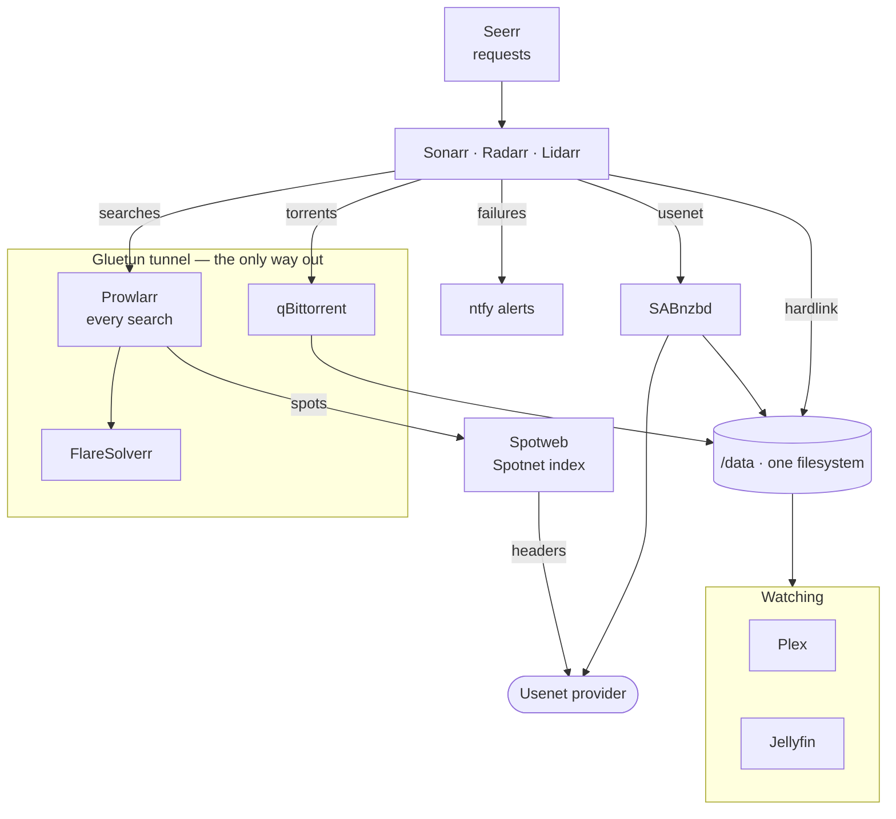

# Media stack

Sixteen containers that find, fetch, name and serve your media, wired together by one script you
can re-run whenever you like. Plex and Jellyfin for watching; Sonarr, Radarr and Lidarr for
deciding what to fetch; Prowlarr with FlareSolverr for searching; SABnzbd and qBittorrent for
fetching; Bazarr for subtitles; Seerr for requests; Recyclarr for quality; ntfy for alerts; a
dashboard generated from the stack itself; and Gluetun, owning the tunnel that the torrent and
indexer traffic never leaves.

Three decisions shape the rest: imports are **hardlinks**, so a file costs its disk space once;
**no path mapping** is ever needed, because every container sees the same `/data`; and **no
credential is committed** — they live in `.env`, which is gitignored and mode 600.

> **Disclaimer — educational purposes only.** This repository documents how these tools fit
> together and is published to learn from. It is provided as is, without warranty of any kind.
> Only use it with content, indexers and services you are entitled to access; obtaining or
> distributing copyrighted material without permission is illegal in most countries and is
> entirely your own responsibility. The authors condone no such use.

## Quickstart

```bash
git clone git@github.com:mike-echo-oscar-whiskey/media-stack.git && cd media-stack
./setup.sh              # writes .env, asking only what no machine can tell
docker compose up -d    # pulls and starts the sixteen containers
./configure.sh          # wires them together through their own APIs
```

`configure.sh` is safe to re-run and is the whole point: every step prints `ok` when it changed
something and `kept` when it found it already right, so a second run should change nothing.

**You need a WireGuard key before you start.** qBittorrent, Prowlarr and FlareSolverr have no route
to the internet except the tunnel, so without one `setup.sh` refuses to finish and those three never
start — see [Torrents through a VPN](#19-torrents-through-a-vpn-gluetun).

Everything after [Starting the stack](#5-starting-the-stack) is either reference, or the manual
equivalent of something `configure.sh` has already done for you.

## How it fits together



Two things that diagram is there to make obvious. **Every search goes through Prowlarr**, so putting
Prowlarr in the tunnel covers the arr apps too — their indexers point at Prowlarr, never at a
tracker. And **the two that talk to your Usenet provider sit outside it**: SABnzbd for the downloads
and Spotweb for the Spotnet index it serves back to Prowlarr. Usenet has no swarm, the provider knows
your account whatever address you arrive from, and the transfer is already TLS, so tunnelling either
would cost throughput and buy nothing.

## Contents

**Getting it running**

1. [Prerequisites](#1-prerequisites)
2. [Directory structure](#2-directory-structure)
3. [Installation commands](#3-installation-commands)
4. [Permissions setup](#4-permissions-setup)
5. [Starting the stack](#5-starting-the-stack)

**How it works**

6. [URLs, hostnames and ports](#6-urls-hostnames-and-ports)
7. [Initial configuration order](#7-initial-configuration-order)
8. [Quality: profiles, formats and guards](#8-quality-profiles-formats-and-guards)

**Per-app setup — mostly done for you**

9. [Sonarr / Radarr root folders](#9-sonarr--radarr-root-folders)
10. [Connecting Prowlarr](#10-connecting-prowlarr)
11. [Connecting download clients](#11-connecting-download-clients)
12. [Connecting Seerr](#12-connecting-seerr)
13. [Connecting Bazarr](#13-connecting-bazarr)
14. [Plex library setup](#14-plex-library-setup)
15. [Music (Lidarr)](#15-music-lidarr)
16. [Dubbed versions (children)](#16-dubbed-versions-children)
17. [Jellyfin alongside Plex](#17-jellyfin-alongside-plex)

**Operating it**

18. [Hardlink verification](#18-hardlink-verification)
19. [Torrents through a VPN (Gluetun)](#19-torrents-through-a-vpn-gluetun)
20. [Updating containers](#20-updating-containers)
21. [Backing up configuration](#21-backing-up-configuration)
22. [Moving to another server](#22-moving-to-another-server)
23. [Alerts (ntfy)](#23-alerts-ntfy)
24. [Keeping the disk from filling](#24-keeping-the-disk-from-filling)
25. [Spotweb, the Spotnet indexer](#25-spotweb-the-spotnet-indexer)

**When something is wrong**

26. [Troubleshooting permissions](#26-troubleshooting-permissions)
27. [Troubleshooting imports](#27-troubleshooting-imports)
28. [Troubleshooting Docker networking](#28-troubleshooting-docker-networking)

---
## 1. Prerequisites

- Linux host (built and verified on EndeavourOS / Arch). Docker Engine ≥ 24 and the Compose
  plugin ≥ 2.20 (`docker compose version`). On Arch: `sudo pacman -S docker docker-compose`
  and `sudo systemctl enable --now docker`.
- Your user in the `docker` group (`sudo usermod -aG docker "$USER"`, then log out and in).
- **Linux is not incidental.** Four things here have no equivalent on Docker Desktop for macOS
  or Windows: Plex's hardware transcoding passes `/dev/dri` or the NVIDIA runtime into the
  container; Plex runs with `network_mode: host`; the four timers are systemd user units; and
  `setup.sh` measures the host with `ip route`, `timedatectl` and `getent group render`. WSL2
  counts as Linux, with limited GPU passthrough and `systemd=true` needed in `wsl.conf`.
- Host tools the scripts use: `docker`, `curl`, `jq`, `python3` with **PyYAML**
  (`pacman -S python-yaml`, `apt install python3-yaml`) — `configure.sh` checks all four and
  stops if one is missing. `migrate.sh` additionally needs `rsync` and `ssh` on both hosts.
- A systemd **user** session for the timers (`heal.sh`, `news.sh`, `missing.sh`, `update.sh`
  install user units). Each installer enables lingering so they also run when you are not
  logged in, or prints the one `sudo loginctl enable-linger` command to run if it cannot.
- **One filesystem for the whole `data/` tree.** Hardlinks and atomic moves only work within a
  single filesystem. ext4, xfs, btrfs and zfs are all fine; what breaks it is splitting
  `data/torrents` and `data/media` across two mounts. Check with `df -h data/torrents data/media`
  — both lines must show the same `Filesystem`.
- Plex Pass if you want hardware transcoding (optional).
- For port-free hostnames (`http://sonarr.<domain>`): a DNS server you control on the LAN
  (Pi-hole, the router, …) and a reverse proxy on the host — see section [URLs, hostnames and ports](#6-urls-hostnames-and-ports). Without them
  everything still works on `http://<ip>:<port>` once `APP_BIND=0.0.0.0`.
- No reverse proxy is included. For access from outside your LAN use
  [Tailscale](https://tailscale.com) (or another VPN) or put a reverse proxy with authentication
  in front. **Never port-forward these web UIs to the internet** — several of them have API keys
  and download-path settings that turn into remote code execution when exposed.

## 2. Directory structure

```text
media-stack/                     # the folder name is yours to choose; compose.yml pins the
                                 # project name, so containers stay media-stack_*
├── compose.yml                  # the stack (hardware-neutral)
├── compose.hwaccel.amd.yml      # optional: Intel/AMD VA-API transcoding for Plex
├── compose.hwaccel.nvidia.yml   # optional: NVIDIA transcoding for Plex
├── gluetun/auth.toml            # Gluetun control-server roles for configure.sh's VPN check
├── spotweb/dbfts_abs.php        # one-character fix for Spotweb's search, mounted over the image's copy
├── .env                         # your values (gitignored)
├── .env.example                 # template
├── jellyfin-users.example.json  # template for jellyfin-users.json (family accounts, gitignored)
├── README.md
├── AGENTS.md                    # repo conventions and known traps, for coding agents
├── CLAUDE.md                    # one line: imports AGENTS.md, so both toolchains read the same file
├── .agents/skills/              # procedures for coding agents, in the vendor-neutral location the
│                                # Agent Skills standard's clients scan: fresh-install-test,
│                                # add-content, remove-content, env-settings
├── .claude/skills/              # symlinks to the above, because Claude Code scans its own path
├── setup.sh                     # asks the few things it cannot measure, writes .env, creates the directories
├── configure.sh                 # wires the running apps together through their APIs
├── lib/                         # one file per section of configure.sh (plex.sh, arr.sh, recyclarr.sh, ...)
│                                # plus recyclarr-config.py, the Recyclarr config writer
├── update.sh                    # pull + snapshot + recreate; installs the weekly timer
├── heal.sh                      # restarts unhealthy containers, clears rejected and unimportable downloads; 2-minute timer
├── news.sh                      # headlines for the dashboard from an RSS/Atom feed; 15-minute timer
├── missing.sh                   # asks Radarr/Sonarr to search everything missing; nightly timer
├── scripts/release-guard.sh     # Sonarr/Radarr custom script: blocks fakes on grab and after import
├── scripts/probe-parser.sh      # ask Radarr/Sonarr what it makes of a title, and test a regex against its own engine
├── scripts/audit-space.sh       # what the disk went to: shared hardlinks vs orphaned downloads
├── migrate.sh                   # move the whole stack to another server (run on the new one)
├── caddy/Caddyfile.example      # reverse-proxy template: one hostname per app, no ports
├── backups/                     # config snapshots and run records from update.sh, heal.sh, missing.sh (gitignored)
├── config/                      # application state, one folder per app (gitignored)
│   └── plex/ jellyfin/ sonarr/ radarr/ lidarr/ prowlarr/ bazarr/ seerr/ sabnzbd/ qbittorrent/ recyclarr/ ntfy/ homepage/
└── data/                        # mounted as /data in every media-handling container
    ├── torrents/
    │   ├── incomplete/          # qBittorrent writes here while downloading
    │   ├── movies/              # qBittorrent category "movies" - Radarr imports from here
    │   ├── tv/                  # qBittorrent category "tv"     - Sonarr imports from here
    │   └── music/               # qBittorrent category "music"  - Lidarr imports from here
    ├── usenet/
    │   ├── incomplete/          # SABnzbd temporary folder
    │   └── complete/
    │       ├── movies/          # SABnzbd category "movies"
    │       ├── tv/              # SABnzbd category "tv"
    │       └── music/           # SABnzbd category "music"
    └── media/
        ├── movies/              # Radarr root folder, Plex "Movies" library
        ├── tv/                  # Sonarr root folder, Plex "TV Shows" library
        ├── music/               # Lidarr root folder, Plex "Music" library
        ├── movies-nl/           # dubbed films, own Plex library (DUB_LANGUAGE, section [Dubbed versions](#16-dubbed-versions-children))
        └── tv-nl/               # dubbed series, own Plex library
```

Why this shape (it is the [TRaSH Guides](https://trash-guides.info/File-and-Folder-Structure/)
layout):

- **One `/data` mount everywhere.** Sonarr, Radarr, SABnzbd and qBittorrent all mount
  `./data` at `/data`. A download that qBittorrent reports as `/data/torrents/tv/Show.mkv`
  is at that exact path for Sonarr too, so Sonarr can `link()` it into `/data/media/tv/…`:
  instant, no extra disk space, the torrent keeps seeding. Separate `/downloads` and `/media`
  mounts are two mount points from the kernel's point of view, and `link()` across mount points
  fails — the *arr apps silently fall back to copying.
- **Per-category subfolders** (`torrents/tv`, `usenet/complete/movies`, …) let each *arr watch
  only its own downloads and stop the two clients from interfering with each other's cleanup.
- **`incomplete/` next to the final folder** means the client's move on completion is an
  atomic `rename()` on the same filesystem — no half-written files for Sonarr to import.
- **Plex mounts only `data/media`, read-only.** It never needs downloads, and a read-only mount
  is one less way for a bug or a misclick to touch your library.
- Cross-seeding tools work unchanged with this layout: everything under `data/torrents` is
  one client's tree and hardlinks in `data/media` keep the originals seedable.

## 3. Installation commands

```bash
git clone <this-repo> media-stack
cd media-stack
./setup.sh              # asks what it cannot measure, writes .env + the directories
docker compose up -d
./configure.sh          # wires the apps together once they are healthy
./update.sh install     # weekly image updates (section [Updating containers](#20-updating-containers))
./heal.sh install       # restarts unhealthy containers every HEAL_INTERVAL (section [Torrents through a VPN](#19-torrents-through-a-vpn-gluetun))
./news.sh install       # refreshes the dashboard headlines every NEWS_INTERVAL (section [URLs, hostnames and ports](#6-urls-hostnames-and-ports))
./missing.sh install    # retries missing films and episodes at MISSING_SEARCH_TIME (section [Quality: profiles, formats and guards](#8-quality-profiles-formats-and-guards))
```

`setup.sh` measures what the machine can tell it — user and group ids, timezone, LAN address
and subnet, the `render`/`video` groups, whether a GPU is present — and asks only for what it
cannot: the hostname suffix, other networks Plex should treat as local, whether Plex may be
reached from outside, a Plex claim token, the locale, subtitle and dub languages, a Usenet
account, a WireGuard key for the VPN, and coordinates for the weather tile. Every question has
a default and Enter takes it; the Usenet and VPN questions are skipped with one keystroke, and
passwords and keys are read without echo. With no terminal — a pipe or a script — it takes
every default silently. Everything else (rate caps, seeding rules, Pi-hole tiles, news feeds,
image tags) has a working default and is documented in `.env` itself.

`setup.sh` needs no root. `.env` is the only file with host-specific values; `DATA_ROOT` and
`CONFIG_ROOT` in it point at the two trees (relative to this directory, or absolute — a big
array for `data/`, for example). It writes `.env` from this machine's values (`id -u`/`id -g`, the
system timezone, the LAN IP and subnet of the default route, the `render`/`video` group ids,
the domain suffix for hostnames — it asks, default `home.arpa`), creates
the `config/` and `data/` trees with the permissions from section [Permissions setup](#4-permissions-setup), and runs
`docker compose config --quiet`. It refuses to overwrite an existing `.env`.

Review the result — `cat .env` — and correct anything the heuristics got wrong (typically
`LAN_IP` on a host with several interfaces). It also enables the matching Plex
hardware-transcoding override when it finds a GPU.

`configure.sh` talks to the running containers' APIs and does everything in [Sonarr / Radarr root folders](#9-sonarr--radarr-root-folders) through [Plex library setup](#14-plex-library-setup)
that does not need one of your accounts: one Web UI login for qBittorrent, Sonarr, Radarr,
Prowlarr, Bazarr and SABnzbd (asked once — Enter generates a password — stored in `.env`);
qBittorrent paths and categories; SABnzbd folders and categories; Sonarr/Radarr root folders and both
download clients, TRaSH-style naming and a Plex library-refresh hook; Prowlarr → Sonarr/Radarr;
Bazarr → Sonarr/Radarr plus a language profile from `SUBTITLE_LANGUAGES`; SABnzbd's Usenet
provider from `USENET_*` (if set); Plex claim (it asks for the token) and the two libraries;
Seerr end to end (signs in as the Plex owner, server, libraries, Sonarr, Radarr); the Homepage
dashboard's config; and a check that every hostname resolves and is served. It is idempotent — re-run it after a restore or when
something was changed by hand. What remains is listed at the end of its output.

Everything host-specific lives in `.env`, `config/` and `data/`, all of which are gitignored,
so the repository itself can be public. **`.env` also holds the Web UI login after
`configure.sh` has run** — if you ever regenerate it, carry `WEBUI_USERNAME`/`WEBUI_PASSWORD`
over.

Manual equivalent, if you prefer to see each step:

```bash
cp .env.example .env
$EDITOR .env          # PUID, PGID, TZ, LAN_IP, SITE_DOMAIN, RENDER_GID/VIDEO_GID

mkdir -p config/{plex,jellyfin,sonarr,radarr,lidarr,prowlarr,bazarr,seerr,sabnzbd,qbittorrent,recyclarr,ntfy,homepage/news} \
         data/torrents/{incomplete,movies,tv,music} \
         data/usenet/{incomplete,complete/{movies,tv,music}} \
         data/media/{movies,tv,music}

docker compose config --quiet && echo "compose file OK"
```

`docker compose config` renders the final configuration with `.env` substituted; any
`variable is not set` warning means a line is missing from `.env`.

## 4. Permissions setup

Every container runs as the user in `PUID`/`PGID` and creates files with `UMASK=002`
(directories `rwxrwxr-x`, files `rw-rw-r--`). The only rule is: **the directory trees must be
owned by that same user and group.** Then all eight apps read and write the same files with no
`chmod 777` anywhere.

Find your ids — do not assume `1000:1000`, the primary group often differs:

```bash
id -u    # -> PUID
id -g    # -> PGID
```

Put those in `.env`. Then, from inside the repository directory only:

```bash
# Ownership - scoped to this stack's directories, nothing else.
sudo chown -R "$(id -u):$(id -g)" config data

# Directories group-writable; files as they come (containers create them with umask 002).
chmod -R u=rwX,g=rwX,o=rX data
chmod -R u=rwX,g=rX,o= config       # app state: nobody else needs to read API keys
```

If you already have a media library elsewhere, **do not chown/chmod it in bulk without
looking first.** Point `DATA_ROOT` at its parent, check ownership with `ls -ln`, and only fix
what is actually wrong.

Why no `chmod 777`: with matching PUID/PGID it is unnecessary, and world-writable media
directories let any process on the host (or any other container with a bind mount) alter your
library.

## 5. Starting the stack

```bash
docker compose up -d
docker compose ps                     # STATUS should read "Up (healthy)" within ~1-2 minutes
docker compose logs -f --tail=50      # Ctrl-C to stop following
```

Useful one-liners:

```bash
docker compose logs -f sonarr         # one service
docker compose restart qbittorrent    # restart one service
docker compose down                   # stop and remove containers (config and data are kept)
```

## 6. URLs, hostnames and ports

### Hostnames (the normal way in)

Every app has a name under `SITE_DOMAIN` (from `.env`), all resolving to this host, all on
port 80 through a reverse proxy:

| Service | URL | Internal name (app-to-app settings) |
|---|---|---|
| Dashboard (Homepage) | `http://media.<domain>` — also the bare `http://<LAN_IP>/` | — |
| Plex | `http://plex.<domain>/web` | `http://<LAN_IP>:32400` (host network, see section [Troubleshooting Docker networking](#28-troubleshooting-docker-networking)) |
| Jellyfin | `http://jellyfin.<domain>` | `http://jellyfin:8096` (section [Jellyfin alongside Plex](#17-jellyfin-alongside-plex)) |
| Seerr | `http://seerr.<domain>` | `http://seerr:5055` |
| Spotweb | `http://spotweb.<domain>` | `http://spotweb` (section [Spotweb, the Spotnet indexer](#25-spotweb-the-spotnet-indexer)) |
| Sonarr | `http://sonarr.<domain>` | `http://sonarr:8989` |
| Radarr | `http://radarr.<domain>` | `http://radarr:7878` |
| Lidarr | `http://lidarr.<domain>` | `http://lidarr:8686` |
| Prowlarr | `http://prowlarr.<domain>` | `http://gluetun:9696` — it runs in the tunnel |
| Bazarr | `http://bazarr.<domain>` | `http://bazarr:6767` |
| SABnzbd | `http://sabnzbd.<domain>` | `http://sabnzbd:8080` |
| qBittorrent | `http://qbittorrent.<domain>` | `http://gluetun:8081` — it runs in the tunnel |
| Recyclarr | none — a cron job, no web interface (its health check watches its own sync log) | — (section [Quality: profiles, formats and guards](#8-quality-profiles-formats-and-guards)) |
| FlareSolverr | none — solves an indexer's browser check on request | `http://gluetun:8191/` — it runs in the tunnel |
| Docker proxy | none — read-only Docker API for the dashboard | `http://dockerproxy:2375` |
| ntfy | `http://ntfy.<domain>` | `http://ntfy` — failure alerts |

Sonarr, Radarr, Lidarr, Prowlarr, Bazarr, SABnzbd, qBittorrent and Jellyfin share the login
that `configure.sh` set: `WEBUI_USERNAME` / `WEBUI_PASSWORD` in `.env`. Plex and Seerr use your
Plex account.

Rotating an app's API key (Settings → General → API Key) needs nothing else: the next
`./configure.sh` brings Prowlarr, Bazarr, Seerr, Homepage and Recyclarr back in line. Prowlarr
masks a stored key on read, so its links are checked with its own test endpoint rather than by
comparison, and Seerr's are checked on every run — not only on a fresh install, which is where
a rotation used to leave them broken silently.

Two things outside this repo make the names work:

1. **DNS**: A records `<name>.<domain> → LAN_IP` for the twelve names above, in whatever
   serves DNS on your LAN (Pi-hole "Local DNS Records", the router, `dnsmasq`, …).
   `configure.sh` checks each name and prints the exact records that are missing. Devices
   reaching the LAN over a VPN need that DNS server too (Tailscale: *split DNS* for the
   domain).
2. **Reverse proxy on :80**: `caddy/Caddyfile.example` is a complete, tested Caddy config —
   run Caddy on the host network (native, or a container with `network_mode: host`) with
   `SITE_DOMAIN` in its environment. It proxies each name to the app's localhost port; for
   SABnzbd it rewrites the `Host` header to the app's own name (SABnzbd whitelists host
   names), for qBittorrent it must **not** (its CSRF check compares `Host` with the browser's
   `Origin`). Any other proxy (Traefik, Nginx Proxy Manager) works the same way.

Plain HTTP by design: private names cannot get public certificates, and the LAN/VPN is the
trust boundary. For HTTPS, use Caddy's internal CA (trust it once per device) or a domain you
own with a DNS-01 wildcard certificate.

### Ports

| Port | Bound to | Purpose |
|---|---|---|
| 80 | `LAN_BIND` (reverse proxy, outside this stack) | all web UIs by hostname |
| 32400/tcp | `LAN_BIND` | Plex clients — they need it directly, not via the proxy |
| 6881 tcp+udp | — | not published: qBittorrent is in the tunnel and the VPN forwards a port instead |
| 3000, 8096, 8989, 7878, 8686, 6969, 9696, 6767, 5055, 8080, 8081, 8087 | `APP_BIND` (default `127.0.0.1`) | the apps' own UIs, for the proxy and for `configure.sh` |

`APP_BIND=0.0.0.0` in `.env` (then `docker compose up -d`) also exposes the app ports on the
LAN as `http://<ip>:<port>` — useful before DNS is in place, or if you skip the proxy.

Nothing else is published. Containers talk to each other on the private `media-stack_media`
network by service name — that name is fixed by `name: media-stack` in `compose.yml`, so it does
not change with the folder you cloned into; those addresses resolve only inside the containers. FlareSolverr has
no UI and no port at all — only Prowlarr reaches it, and since both run in the tunnel the address is `http://gluetun:8191`.

### Dashboard

Homepage (`http://media.<domain>`) is generated by `configure.sh` on every run:

- **Media**: Plex (streams, library counts) and Seerr (pending, processing, available).
- **Recently added**: the newest films and the newest seasons, read from Plex's Movies and
  TV Shows libraries, each line opening the item in Plex Web.
- **Today**: two agendas, episodes airing (Sonarr) and films releasing (Radarr), and one
  headlines tile per entry in `NEWS_FEEDS`; an entry with several feed URLs becomes one mixed
  tile, newest item of each source in turn (`news.sh` fetches them, `./news.sh install` keeps
  them fresh every 15 minutes; the dashboard reads the results from its own container).
- **Downloads** and **Automation**: one tile per app with its queue and wanted counts. Sonarr
  and Lidarr show missing items as *Wanted*; only Radarr's widget separates wanted from
  missing.
- **Infrastructure**: the VPN exit (address, country, forwarded port); an **Alerts** tile linking
  to ntfy; up to two Pi-hole tiles (`PIHOLE_*`, `PIHOLE2_*`), e.g. one per site; and the three
  services that have no interface at all — Recyclarr, FlareSolverr and the Docker proxy — whose
  tiles exist for their container state. A Pi-hole at another site is reached over the tunnel,
  which needs the gateway to masquerade container traffic into it (the dns repo's bootstrap
  does). Their monitor is an ICMP ping of the host, not an HTTP check: Homepage's HTTP monitor
  only sends HEAD, and Pi-hole v6 answers HEAD with 405 plus framing the dashboard's parser
  rejects, on every route. So the tile's dot reports the host and the widget beside it reports
  Pi-hole itself.
- Header: host resources, the weather for `WEATHER_LATITUDE`/`WEATHER_LONGITUDE` (Open-Meteo,
  no account) and the clock in `UI_LOCALE`'s format. Typing on the page searches the tiles
  (quick launch).

Every tile carries a status dot from a site monitor on its internal address and, through the
Docker proxy (below), its container's state. CPU and memory start folded: click a status dot to
expand that container's figures. They fold back on the next page load, because Homepage keeps no
memory of it — the open state is seeded from `showStats` on every load. Setting `showStats` in
`settings.yaml` is worse than it looks: there it *forces* the panel open and the fold click
cannot close it at all. Note that the memory figure is the Docker API's, which charges the
kernel's page cache to the container: qBittorrent reading and writing torrents shows tens of
gigabytes where its own footprint is about 30 MB.

The API keys live in `config/homepage/services.yaml` (mode 600). `settings.yaml`,
`widgets.yaml` and `docker.yaml` are regenerated too; put `# keep` on the first line of any of
them to take it over. `bookmarks.yaml`
is yours from the start. The Plex tile gains its widget once the server is claimed.

### Container state on the dashboard

Every tile shows its container's state and, when you click the status dot, its CPU and memory.
That comes from the Docker API, which the dashboard reaches through **`dockerproxy`**
([tecnativa/docker-socket-proxy](https://github.com/Tecnativa/docker-socket-proxy)) rather than
the socket itself: the proxy answers `GET` only (`POST=0`) and only under `/containers`
(`CONTAINERS=1`), publishes no port and sits on the internal network. A `POST` to restart a
container comes back `403`.

It is still a privilege worth naming. `/containers/{id}/json` includes each container's
environment, so anything that can reach the proxy can read **Gluetun's WireGuard private key**
and the apps' API keys. Homepage already holds those API keys in its own `services.yaml`; the VPN
key is what this adds. Nothing else on the `media` network is exposed to the outside, and the
proxy is not published — that is what keeps the trade acceptable. If you would rather not make
it, remove the `dockerproxy` service and the `server:`/`container:` lines survive harmlessly as
no-ops (`docker.yaml` simply stops resolving).

It also buys tiles for the services that have no interface at all — Recyclarr, FlareSolverr and
the proxy itself — where the container state is the only thing there is to know.

## 7. Initial configuration order

Each step needs a credential or setting produced by the previous one, so do them in this order:

| # | App | Why here |
|---|---|---|
| 1 | `docker compose up -d` | everything else needs running containers |
| 2 | qBittorrent, SABnzbd | produce the password / API key the *arr apps need |
| 3 | Plex, Jellyfin | claim Plex, complete Jellyfin's wizard, create the libraries — the *arr apps' library hooks need them |
| 4 | Sonarr, Radarr, Lidarr | root folders, download clients (from step 2), Plex and Jellyfin hooks; note their API keys |
| 6 | Prowlarr | pushes indexers into the *arr apps, so those must exist first with API keys; registers FlareSolverr |
| 7 | Bazarr | reads series and movies from Sonarr/Radarr; links to Plex and Jellyfin |
| 5 | Spotweb | reuses the Usenet account from step 2 and issues the API key Prowlarr needs |
| 8 | Seerr | signs in via Plex and proxies requests to Sonarr/Radarr — needs those finished |

`./configure.sh` performs steps 2–8 in exactly this order. [Connecting Prowlarr](#10-connecting-prowlarr) through [Hardlink verification](#18-hardlink-verification), plus the VPN, Jellyfin and migration chapters, describe
what it did (and how to do it by hand). What remains **manual** is exactly what needs one of your
accounts: indexers in Prowlarr, subtitle providers in Bazarr, and your Usenet provider's
credentials (which you can hand to the script through `USENET_*` in `.env`).

`configure.sh` sets one login on all seven local UIs (Forms authentication, required on the LAN
too), so no first-visit password prompts remain. It asks for username and password on its
first run (Enter generates a password). To choose a different one later, run
`./configure.sh --set-login` — it asks again and re-applies the login everywhere, including
qBittorrent, which it resets safely if the old password is unknown. `.env` is the source of
truth: whatever `WEBUI_USERNAME`/`WEBUI_PASSWORD` say is what every app gets on the next run.

## 8. Quality: profiles, formats and guards

What a release has to be to be worth downloading: which profiles exist and where they come
from, and what is refused before it ever reaches the disk.

### Where the profiles come from

Quality is not hand-written here. A **Recyclarr** container (MIT, the tool the guides' own
community uses) syncs the [TRaSH Guides](https://trash-guides.info/) into Radarr and Sonarr and
keeps them current: the quality definitions (how big a release may be per minute of runtime),
the custom-format collection with the guides' scores — release-group tiers, audio formats, HDR,
streaming services, the low-quality and unwanted lists — and four quality profiles per app:

| `MEDIA_QUALITY` | Radarr profile | Sonarr profile |
|---|---|---|
| `1080p-encode` | `HD Bluray + WEB` | `WEB-1080p` |
| `1080p-remux` | `Remux + WEB 1080p` | `Remux + WEB 1080p` |
| `2160p-encode` | `UHD Bluray + WEB` | `WEB-2160p` |
| `2160p-remux` | `Remux + WEB 2160p` | `Remux + WEB 2160p` |

All four exist at once, so any title can be asked for differently — in Seerr under *Advanced*,
or in the app itself. `MEDIA_QUALITY` only says which one is the **default**: the profile Seerr
requests with, and the one a film or series on a stock profile is moved onto. These profiles
choose the best release available rather than the smallest, and they allow upgrades, so a WEB-DL
is replaced when a Blu-ray-sourced release of the same title turns up. Watch the disk.

`configure.sh` writes `config/recyclarr/configs/{radarr,sonarr}.yml` from the templates
Recyclarr ships, fills in the URL and API key, and runs one sync; the container then re-syncs on
`RECYCLARR_SCHEDULE` (`@daily`). Put `# keep` on the first line of either file to take it over.

It serves nothing, so there is no page to open and nothing for a dashboard tile to poll. Its
**health check** asks the only question that matters instead: does a log from the last two days
say `Completed at`? If the schedule stops being kept — a failed git fetch, a template the guides
no longer ship — the container goes unhealthy, `docker compose ps` says so and `heal.sh` restarts
it. An installation that has never synced has no logs and counts as healthy until the first run.
This is also why `wait_healthy` in `configure.sh` ignores services that declare no health check:
a container without one reports an empty status forever.
Two details worth knowing if you edit them: the four templates per app are merged into **one
instance**, because Recyclarr groups instances by `base_url` and silently does nothing when
several share a server; and `reset_unmatched_scores` is off, or a sync would clear the scores of
the formats that are ours rather than the guides'.

What `configure.sh` still owns, because no guide covers it: the **dubbed twins** (section [Dubbed versions](#16-dubbed-versions-children)),
which profile is the default, and the release guard below. Every other quality decision —
which formats exist, what they score, what each profile accepts — belongs to the guides. Profiles this stack managed before the
guides took over (`1080p Encode` and friends) are emptied onto the default and deleted.

### Fakes, cams and anything under 720p

No custom format of ours stands between you and a bad release; the quality rules are the
guides' and stay that way.

Cams, screeners and low-resolution rips are handled by the profile, not by a format. `CAM`,
`TELESYNC`, `TELECINE`, `WORKPRINT`, `REGIONAL`, `DVDSCR`, `SDTV` and the 480p/576p tiers are
*qualities* in Radarr and Sonarr, and the guide profiles do not allow them — `HD Bluray + WEB`
permits exactly Bluray-720p, WEB 1080p and Bluray-1080p. Anything parsed into another quality
is refused before a format score is counted. That is why the TRaSH guides ship no cam format
either: their `LQ` formats only list release groups. Junk that announces itself in the title,
from bad groups to AI upscales, is covered by the guides' own `LQ`, `LQ (Release Title)` and
`Upscaled` formats, all scored -10000 in every managed profile.

Fakes are different, because a fake carries a perfectly good quality and often a clean title.
Unreleased films attract them: AI "versions", fan edits and uploads named after the film that
are something else entirely. Radarr's *minimum availability* keeps RSS from grabbing before
the digital release, but a search — manual, or triggered by a request — ignores it and takes
what is offered. Three fake *Odyssey* releases arrived that way on 2026-09-23.

Title patterns are the wrong tool for that. This stack tried them, and the history shows why
they were dropped: every one of those fakes was *grabbed* and only then failed, including the
two whose titles carried a marker, while the one with a clean title could never have matched a
pattern at all. What stopped all of them was the check below, which looks at the release date
and the file itself rather than at its name.

If you do reach for a pattern — a dubbed-audio tag, say (section [Dubbed versions](#16-dubbed-versions-children)) — never guess what it
matches. Ask the app's own parser:

```bash
./scripts/probe-parser.sh radarr "Some.Movie.2026.HDCAM.1080p.x264-GRP"
./scripts/probe-parser.sh sonarr -r '\b(NLD|NL[ ._-]?Gesproken)\b' "Show.S01E01.1080p.WEB-DL.NLD.x264"
```

Without `-r` it prints the quality, languages and custom formats the app matches for a title.
With `-r` it creates a throwaway custom format holding that regex, reports which titles it
catches, and deletes it again. The engine is .NET's rather than grep's, and the difference
bites: a pattern that reads correctly in a shell can match nothing here.

Two automatic checks come on top, run by `scripts/release-guard.sh` (mounted at `/scripts`
in Sonarr and Radarr, wired as a *Custom Script* connection by `configure.sh`):

- **On grab**: a film whose digital or physical release is still ahead, or an episode that
  has not aired, cannot have a genuine release yet. The grab is removed from the queue and
  blocklisted before anything is downloaded. Radarr's own *minimum availability* only guards
  its RSS runs; a search, and Seerr requests trigger one, walks past it. Sonarr passes the
  episodes' air dates to the script, but not always — when that list arrives empty the script
  asks the API instead of assuming the episode is out, which is how a release of an episode
  four days in the future was grabbed on 2026-09-24.
- **On import**, three checks in order:

  1. **Not out yet?** Rejected outright, whatever the file looks like — a cinema recording of
     the right length passes every other test.
  2. **Runtime.** The file's duration against what TMDb or TVDB publish. Shorter than 90 % or
     longer than 115 % (`GUARD_MIN_RATIO` / `GUARD_MAX_RATIO`) means a fake or a mislabelled
     upload. Narrow on purpose: across 49 imports here every genuine file measured within 2 %
     of its runtime and the one fake came in at 50 %. The cost is alternate cuts — an extended
     or director's cut runs 1.1 to 1.4× the theatrical runtime, so the guard rejects and
     blocklists every copy of one. Raise `GUARD_MAX_RATIO` if you want them.
  3. **Frame size.** A release named 1080p must reach about 1920 wide or 1080 high. Letterboxed
     and pillarboxed films pass; a 720p upscale sold as 1080p does not.

  Any failure marks the grab failed, which blocklists it, deletes the file and starts a fresh
  search — but only once the title is actually out. An unknown runtime gives no verdict rather
  than a guess. Every decision is logged to `config/<app>/release-guard.log`.
- **Afterwards**: a torrent rejected on import keeps seeding in qBittorrent, because the app
  stops tracking a download once imported. `heal.sh` (section [Torrents through a VPN](#19-torrents-through-a-vpn-gluetun)) matches the apps' failed
  downloads against qBittorrent every two minutes and deletes those torrents with their files.
- **Payloads that never fail**: a release carrying an executable downloads perfectly and is
  then refused at import, as a *warning*. Nothing marks it failed, so the app's own
  "redownload failed" never fires and the item sits in the queue for good — while the queue
  says the episode is being handled, it stays missing. `heal.sh` blocklists and removes those,
  matching only that message, which no retry can ever clear. Anything merely slow (a season
  pack still unpacking, a release held as "not an upgrade") is left alone.
- **Seeding what you no longer keep**: an upgrade replaces a file, or the guard rejects one,
  and the library copy is deleted — but the torrent keeps its own name for the same bytes and
  carries on uploading. The apps leave it alone on purpose, because the seed was promised when
  the torrent was grabbed. `heal.sh` removes such a torrent **with its data** once qBittorrent
  has stopped it, which happens at ratio 1 or 24 hours, so the obligation is met first. A
  torrent still in an app's queue is never touched, and neither is anything in a category
  listed in `HEAL_ORPHAN_KEEP` — what you fetched by hand is yours to sort.
- **Data nothing owns at all**: when such a torrent has already left the client, its files stay
  behind owned by nobody, and they grow with every upgrade — 32 GB had accumulated by
  2026-09-25, most of it one remux replaced hours after it imported. `heal.sh` deletes a file
  under `data/torrents` when it has no second name in the library, no torrent covers it, every
  app's queue is empty, and nothing has touched it for `HEAL_ORPHAN_HOURS` (24 by default; 0
  turns the sweep off).

### Retrying what stalled

After a failed download Radarr and Sonarr blocklist the release and try the next candidate
at once, but once they run out they stop for good; from then on the title only returns if a
brand-new release appears in the hourly RSS feed. `./missing.sh` asks both apps to search
everything they still lack, and `./missing.sh install` runs it nightly at 02:00, inside the
unrestricted window (section [Connecting download clients](#11-connecting-download-clients)), with the profiles and the guards applied as on any other
grab. Only released films are searched: Radarr's own missing search
ignores release dates and would fetch fakes of unreleased ones. `./missing.sh status` shows
the last run.

When a fake does get in anyway: on the film's page in Radarr, Activity → History, click
*Mark as failed* on the grab. That blocklists the release, and after deleting the file
(Files → the bin) a new search skips it. Seerr cannot do this; it only requests.

## 9. Sonarr / Radarr root folders

`configure.sh` also sets each app's Settings → UI from `.env`. `UI_LOCALE` is the switch —
empty or `en-US` leaves the apps at their own defaults — and three keys say what to apply:
`UI_DATE_FORMAT` (`YYYY-MM-DD`, `DD/MM/YYYY` or `MM/DD/YYYY`, with the long date and the
calendar's week column following from it), `UI_TIME_FORMAT` (`24h` or `12h`, which the
dashboard clock follows too) and `UI_FIRST_DAY_OF_WEEK` (`monday` or `sunday`). The language
stays English. Same in Lidarr and Prowlarr.

**Sonarr** → Settings → Media Management → Root Folders → Add:

```text
/data/media/tv
```

**Radarr** → Settings → Media Management → Root Folders → Add:

```text
/data/media/movies
```

In both, under Settings → Media Management → *Importing*, make sure **Use Hardlinks instead of
Copy** is on (it is the default). Do not tick "Remote Path Mappings" for anything — every
service sees the same `/data` paths, so there is nothing to map.

`configure.sh` also turns on renaming with the [TRaSH Guides](https://trash-guides.info/)
naming formats (Plex-friendly, with `{tvdb-…}`/`{tmdb-…}` folder tags) — only while the app
still has its factory format, so anything you change under *Episode/Movie Naming* stays — and
adds a **Plex** connection (Settings → Connect) so Plex refreshes the library right after an
import, rename or delete. The connection is added once the Plex server is claimed.

`configure.sh` reads each app's API key from `config/<app>/config.xml` for Prowlarr and
Bazarr. Seerr (manual) needs them too: Settings → General → Security → API Key.

## 10. Connecting Prowlarr

Prowlarr is the single place you configure indexers; it pushes them into Sonarr and Radarr and
keeps them in sync. Add only indexers you have an account with and are entitled to use.

Steps 1–2 are done by `configure.sh`, which also registers SABnzbd and qBittorrent as
Prowlarr's own download clients so a grab from Prowlarr's search page works, with the
indexer category mapped to the client category the apps use (Movies → `movies`, TV → `tv`,
Audio → `music`, anything else → `prowlarr`); step 3 is **manual** (your
accounts).

1. Prowlarr → Settings → Apps → **+** → Sonarr:
   - Prowlarr Server: `http://gluetun:9696` (Prowlarr runs in Gluetun's namespace)
   - Sonarr Server: `http://sonarr:8989`
   - API Key: Sonarr's key from section [Sonarr / Radarr root folders](#9-sonarr--radarr-root-folders)
   - Sync Level: *Add and Remove Only* (default) — Test, then Save.
2. Repeat for Radarr with `http://radarr:7878` and Radarr's key, and for Lidarr with
   `http://lidarr:8686` and Lidarr's key.
3. Prowlarr → Indexers → **+** → add your indexers. Each one appears in Sonarr/Radarr under
   Settings → Indexers within a minute, tagged as managed by Prowlarr.

Use the service names above, not the host's IP. Docker DNS resolves them on the stack's
network, they survive an IP change on the host, and they do not depend on a port that is
published to the LAN.

### Cloudflare-protected indexers (FlareSolverr)

Some indexer sites put a Cloudflare "checking your browser" page in front of every request,
which Prowlarr cannot pass on its own. FlareSolverr is a small service with a headless
Chromium that passes it for Prowlarr. `configure.sh` registers it (Settings → Indexers →
Indexer Proxies → *FlareSolverr*, host `http://gluetun:8191/`) together with a tag named
`flaresolverr`. Prowlarr uses the proxy only for indexers that carry that tag, and even then
only when it actually meets a Cloudflare challenge — so:

- an indexer that fails with a Cloudflare error: edit it in Prowlarr, add the tag
  `flaresolverr`, Test again;
- everything else stays untouched.

The container idles at ~400 MB and takes up to ~1 GB while solving a challenge (it is a browser).
Nothing about it changes the rule above: only indexers you have an account with.

## 11. Connecting download clients

### qBittorrent

`configure.sh` does all of this; the settings it applies are listed here so you can check or
redo them. Log in at `http://qbittorrent.<domain>` with `WEBUI_USERNAME`/`WEBUI_PASSWORD` from `.env`. (On a
container that was never configured, qBittorrent prints a one-time password to its log —
`docker compose logs qbittorrent | grep -A1 'temporary password'` — and `configure.sh` uses it
to set the permanent one.)

- **Tools → Options → Web UI**: username and password (stored hashed in
  `config/qbittorrent/qBittorrent/qBittorrent.conf` — never in `compose.yml`).
- **Options → Downloads**:
  - Default Save Path: `/data/torrents`
  - Keep incomplete torrents in: `/data/torrents/incomplete` (tick it)
  - "Append .!qB extension" on; it stops the *arr apps from importing a partial file.
  - Seeding limits from `TORRENT_SEED_RATIO` / `TORRENT_SEED_DAYS` (stop when either is
    reached — that is what lets Sonarr/Radarr's *Remove Completed* clean the torrent up).
    Measured here, ratio 1 arrives after about three hours and the day limit has never
    fired, so ratio is what binds and the day is the backstop.
  - **Private trackers seed by time instead.** A public tracker keeps no account of what you
    return, but a private one usually calls a torrent a hit and run unless it seeded a minimum
    period, whatever ratio it reached — and a ratio cap would stop it hours short.
    `configure.sh` therefore reads each indexer's privacy from Prowlarr and sets a *seed time*
    of `TORRENT_PRIVATE_SEED_HOURS` (72 by default) with **no** ratio cap on the private ones,
    through Sonarr's and Radarr's own per-indexer seed criteria. Public indexers get neither
    and fall back on the global pair. Check your tracker's rules before lowering it. A torrent
    may also carry a stray share limit from whatever added it; `heal.sh` puts those back on
    *Use global share limits* — except the private stamp, which it recognises and leaves.
  - Speed limits (Options → Speed) from `TORRENT_MAX_KIB` / `TORRENT_UPLOAD_MAX_KIB` — KiB/s,
    because that is the unit qBittorrent stores, so the number is applied exactly; convert a
    line speed with KiB = Mbit × 125000 ÷ 1024 — so
    the rest of the network keeps bandwidth; `UNRESTRICTED_HOURS` becomes the alternative-
    limit schedule with no limits in that window. 0 = unlimited. The upload cap matters more
    once private trackers are seeding for days: it is what stops a long seed taking the whole
    uplink while a Plex client is streaming from outside the house.
- **Options → Connection**: listening port `6881` (matches `TORRENTING_PORT` and the published
  port). Turn *off* UPnP/NAT-PMP — forward the port on your router by hand if you want it.
  The port is whatever the VPN provider forwards; Gluetun
  sets it, and *Bypass authentication for clients on localhost* is on for that.
- **Categories** (right-click *Categories* in the sidebar → Add category):
  - `tv` → save path `/data/torrents/tv`
  - `movies` → save path `/data/torrents/movies`
  - `music` → save path `/data/torrents/music`

Then in **Sonarr** → Settings → Download Clients → **+** → qBittorrent:

| Field | Value |
|---|---|
| Host | `gluetun` |
| Port | `8081` |
| Username / Password | what you set above |
| Category | `tv` |
| Remove Completed | on (Sonarr removes the torrent once seeding rules are met) |

Test, Save. Same in **Radarr** with category `movies` and in **Lidarr** with category `music`.

### SABnzbd

Your Usenet provider is your own account: either put it in `.env` (`USENET_HOST`,
`USENET_PORT`, `USENET_USERNAME`, `USENET_PASSWORD`, `USENET_CONNECTIONS`) and re-run
`configure.sh`, or add it by hand under Config → Servers. Everything below is done by
`configure.sh`, including the line-speed cap from `USENET_MAX_KIB` (Config → General,
*Maximum line speed*) and, for `UNRESTRICTED_HOURS`, two scheduler entries that lift the cap
at the start of the window and restore it at the end:

- **Config → Folders**:
  - Temporary Download Folder: `/data/usenet/incomplete`
  - Completed Download Folder: `/data/usenet/complete`
- **Config → Categories**: add `tv`, `movies` and `music`, each with a folder of the same name
  (relative to the completed folder, i.e. they land in `/data/usenet/complete/<category>`).
- **Config → General → Security**: copy the **API Key**.

SABnzbd refuses requests whose `Host` header it does not know ("Access denied - Hostname
verification failed"). `compose.yml` sets `hostname: sabnzbd` on the container, and SABnzbd
whitelists its own hostname when it creates its config, so `http://sabnzbd:8080` works from
Sonarr/Radarr on a fresh install. If you brought an existing `config/sabnzbd` along, add it
yourself: Config → Special → `host_whitelist` → append `sabnzbd`, Save, restart SABnzbd.

In **Sonarr** → Settings → Download Clients → **+** → SABnzbd:

| Field | Value |
|---|---|
| Host | `sabnzbd` |
| Port | `8080` |
| API Key | from above |
| Category | `tv` |

Same in **Radarr** with category `movies` and **Lidarr** with category `music`.

Finally, in Sonarr, Radarr and Lidarr → Settings → Download Clients → *Completed Download
Handling*: **Enable** on, **Remove Completed** on. This is what turns a finished download into a
hardlinked, renamed file in `/data/media/…`. `configure.sh` also turns on *Import Extra Files*
(`srt,sub,idx,ass,ssa`), so subtitles shipped with a release are kept next to the video
instead of being discarded and searched for again by Bazarr.

## 12. Connecting Seerr

Seerr is the request front-end: users browse, request, and Seerr hands the request to Sonarr or
Radarr and reports availability from Plex.

`configure.sh` does the whole setup wizard once Plex is claimed: it signs Seerr in with the
Plex owner's token (Plex stores it in its own config after the claim), registers the server as
`http://<LAN_IP>:32400`, enables the libraries, adds Radarr and Sonarr (`http://radarr:7878`,
`http://sonarr:8989`, root folders `/data/media/movies` and `/data/media/tv`, quality profile
`HD-1080p` or the app's first profile) as defaults, sets the application URL to
`http://seerr.<domain>`, sets the region from `PLEX_CERTIFICATION_COUNTRY` with English
metadata, turns on the owner's Plex **watchlist sync** (anything added to the watchlist in
Plex becomes a Seerr request within three minutes) and marks the wizard complete. You then
simply open `http://seerr.<domain>` and *Sign in with Plex* with the same account.

The watchlist sync only works for accounts that signed in to Seerr themselves, because Seerr
polls plex.tv with the token it stored at login. Managed Plex Home users have no e-mail
address, cannot be imported into Seerr and therefore have no watchlist sync; their profiles
do have a watchlist in Plex, it just stays in Plex.

By hand, the same steps are:

1. Open `http://seerr.<domain>` → **Sign in with Plex** (the account that owns the Plex server).
2. Settings → Plex → **Server**: Hostname/IP `plex`, Port `32400`, SSL off; Save, **Sync
   Libraries**, tick *Movies* and *TV Shows*.
3. Settings → Services → **Radarr** → Add: Hostname `radarr`, Port `7878`, API key from
   Radarr, Test, Quality Profile, Root Folder `/data/media/movies`, *Default Server*, Save.
4. Settings → Services → **Sonarr** → Add: hostname `sonarr`, port `8989`, root folder
   `/data/media/tv`.
5. Settings → Users: decide who may request; Plex Home / friends sign in with their own Plex
   accounts.

## 13. Connecting Bazarr

Bazarr downloads subtitles for what Sonarr and Radarr manage. It sees the media at the same
paths they report, so no path mapping is needed.

Steps 1–3 are done by `configure.sh`: profile 1 always mirrors `SUBTITLE_LANGUAGES` in `.env`
(order = preference; change the value and re-run; profiles you add yourself are untouched),
and once Plex is claimed the Plex link is configured too — classic token method with the
server owner's token, `http://<LAN_IP>:32400`, "refresh item" and "set added date" after every
subtitle download, so new subtitles show up in Plex at once. Step 4 is **manual** —
providers need your accounts.

1. Open `http://bazarr.<domain>` → Settings → **Sonarr**: enable, Address `sonarr`, Port `8989`,
   API key from Sonarr, *Test*, Save. Leave *Path Mappings* empty.
2. Settings → **Radarr**: Address `radarr`, Port `7878`, its API key. Same.
3. Settings → **Languages**: the language profile and its defaults for series and movies.
4. Settings → **Providers**: add subtitle providers you have accounts for.
5. Settings → **Subtitles**: *Use embedded subtitles* stays on (default), so a file that
   already carries a language is not searched for it again.

Expected paths inside Bazarr: `/data/media/tv/<Series>/…` and `/data/media/movies/<Movie>/…`.
Subtitle files are written next to the video, which is why Bazarr's `/data/media` mount is
read-write while Plex's is read-only.

## 14. Plex library setup

1. Claim (**manual token, scripted apply**): `configure.sh` asks for a token from
   <https://www.plex.tv/claim>, applies it and clears it again. By hand: put it in `.env` as
   `PLEX_CLAIM=claim-…`, run `docker compose up -d plex` within four minutes, then clear the
   value; it is single-use. Libraries (step 4) are created by `configure.sh` as well.
2. Open `http://plex.<domain>/web`, sign in, name the server.
3. Settings → Network is set by `configure.sh` once the server is claimed: *Custom server
   access URLs* = `http://LAN_IP:32400` (clients on the LAN, a routed site or your VPN connect
   directly), *LAN Networks* = `PLEX_LAN_NETWORKS` (those ranges get full-speed local
   playback instead of remote-stream caps), and, if `PLEX_PUBLIC_PORT` is set, a fixed
   public port under *Remote Access*.
4. Add libraries:
   - **Movies** → folder `/data/media/movies`
   - **TV Shows** → folder `/data/media/tv`
   - **Music** → folder `/data/media/music` (Plex Music agent; Plexamp plays it)
   - **Movies (Dutch)** / **TV Shows (Dutch)** → `/data/media/movies-nl`, `/data/media/tv-nl`,
     only when `DUB_LANGUAGE` is set — section [Dubbed versions](#16-dubbed-versions-children)
   `configure.sh` also turns on *Scan my library automatically*, *Run a partial scan when
   changes are detected* and a daily scheduled scan (Settings → Library) — without the
   partial-scan setting Plex answers Sonarr's and Radarr's import-time refresh requests with
   200 and scans nothing; the daily full scan is only a safety net, new media arrives through
   the watcher and the arr hooks within seconds. The Plex connection in Sonarr/Radarr (Settings → Connect) is added
   by `configure.sh` as well.
   Each library's *Certification Country* is set from `PLEX_CERTIFICATION_COUNTRY` in `.env`
   (age ratings shown in your country's system).
5. **Hardware transcoding** (Plex Pass): `setup.sh` enables the matching `COMPOSE_FILE`
   override when it finds a GPU (or uncomment the line in `.env` and `docker compose up -d
   plex`); `configure.sh` then switches Plex's hardware decoding and encoding on as soon as
   the container can see the device. On Intel/AMD, `RENDER_GID`/`VIDEO_GID` in `.env` must
   match `getent group render video` on the host. Verify with `docker compose exec plex ls -l
   /dev/dri` (files present, not "No such file") and a playing stream showing *(hw)* in the
   dashboard.

### Switched off by `configure.sh`

- **Online Media Sources** (plex.tv account setting, Settings → Online Media Sources):
  *Movies & Shows on Plex*, *Live TV* channels and the retired News, Podcasts and Web Shows
  are set to *Disabled*. Every client home screen otherwise fetches those rows from the
  internet on each visit, which is most of what makes the TV apps feel slow. Disabling them on
  the admin account covers the managed Home users as well. *Sync my watch state* stays on;
  the watchlist and Continue Watching need it.
- **Debug logging** (Settings → General): rotates a 10 MB log every few minutes on a busy
  server. Turn it back on in Plex only while diagnosing something.
- **Crash reports**, **Allow media deletion** (removals go through Sonarr/Radarr, which keep
  their own databases in step) and **ad-marker analysis** (only DVR recordings contain ad
  breaks, and the stack makes none).

Relay, cinema trailers, intro and credits markers, chapter thumbnails, push notifications
and local discovery are left as Plex ships them.

### Remote access

Plex's *Remote Access* status means "reachable from the internet".

- **Default — public port** (`PLEX_PUBLIC_PORT=32400`): forward TCP 32400 on your internet
  router to `LAN_IP:32400`; `configure.sh` sets the matching manual port in Plex and *Remote
  Access* turns green for any network. Plex account authentication is then the only barrier —
  this is the one service in the stack designed for that, so keep it updated
  (`docker compose pull`) and do not forward anything else.
- **Opt-out — VPN only** (`PLEX_PUBLIC_PORT` empty): nothing is exposed. Devices on Tailscale
  (or a site routed to this LAN) still reach `http://LAN_IP:32400` directly because the server
  advertises that address. Plex's status page then says "not available outside" — correct
  and intended; clients without the VPN cannot connect.

Either way, `PLEX_LAN_NETWORKS` (this LAN, other sites' LANs, the VPN range — `setup.sh`
asks) decides who gets full-speed local playback instead of remote-stream caps.

Plex runs on the **host network** (`network_mode: host`), unlike every other service. Behind a
published port Docker's userland proxy hands Plex every connection from the bridge address
(`172.18.0.1`), so Plex cannot tell a TV in the living room from a viewer on the internet and
treats them all as remote: remote bandwidth caps and the client's remote quality apply to
everyone, and `PLEX_LAN_NETWORKS` never matches. On the host network Plex sees real client
addresses and the local/remote distinction works; it listens on 32400 directly (plus its GDM and
DLNA discovery ports, so LAN auto-discovery works too) and the other containers reach it at
`http://<LAN_IP>:32400` rather than by a service name — `configure.sh` fills that in. The firewall note in section [Plex library setup](#14-plex-library-setup) still applies: 32400/tcp must be allowed.

Two more things decide whether a client on the LAN really connects directly:

- **Advertised addresses.** On the host network Plex would also publish the Docker bridge
  addresses (`172.17.0.1`, `172.18.0.1`) as local connections, and every client tries and
  times out on those first. `configure.sh` pins Plex's *preferred network interface* to the
  one that carries `LAN_IP`, so only the real address is published.
- **DNS rebind protection.** Plex clients prefer the secure connection
  `https://<ip-dashed>.<hash>.plex.direct:32400`, a public name that resolves to the server's
  *private* address on purpose (it is how a private IP gets a valid certificate). Resolvers with
  rebind protection, such as Unbound with `private-address:` or Pi-hole's rebind setting,
  strip that answer; the client then fails the direct connection and quietly falls back to
  Plex's internet relay, which shows as slow menus and posters on the LAN and `127.0.0.1` as the
  player address in the server's sessions. Whitelist the domain: Unbound `private-domain:
  "plex.direct"`, dnsmasq `rebind-domain-ok=/plex.direct/`. Check from any LAN device with
  `dig <name>.plex.direct` — an empty answer means the resolver is stripping it.

## 15. Music (Lidarr)

Lidarr is Sonarr/Radarr for music: it monitors artists and albums (MusicBrainz metadata),
searches through the same Prowlarr indexers, downloads through the same SABnzbd/qBittorrent
(category `music`) and imports into `/data/media/music/<Artist>/<Album> (Year)/…` with
hardlinks. Plex gets a **Music** library on that folder (Plex Music agent); Plexamp is the
player to use with it.

`configure.sh` wires all of it: the shared login, root folder `/data/media/music` (default
quality profile *Standard*, metadata profile *Standard*), both download clients, renaming
(Lidarr's default track format), the Plex library-refresh hook, the Prowlarr application and
the dashboard tile. Lidarr thinks in **albums**: requesting a track means getting its album.

Manual, as everywhere: indexers come from Prowlarr, so nothing to add here — but music
availability on Usenet/torrent indexers is thinner than film/TV.

## 16. Dubbed versions (children)

Subtitles (section [Connecting Bazarr](#13-connecting-bazarr)) are useless to a child who cannot read yet: the *audio* has to be in
their language. The whole section is optional and **off as shipped**: with `DUB_LANGUAGE`
empty nothing here exists — no custom formats, no profile, no extra root folders, no extra
Plex or Jellyfin libraries and no extra Seerr servers. Set it to an ISO 639-1 code (`nl`,
`de`, `fr`, …) and `configure.sh` builds, in **Radarr and Sonarr**:

- two custom formats — *Dutch Audio*, matching the language the app parses from the release, and
  *Dutch Dub (title)*, matching the spellings its parser does not know (`NLD`, `NL Gesproken`,
  `Nagesynchroniseerd`). Both deliberately avoid the bare word "Dutch", which the first format
  already covers and which would otherwise match a film *called* "The Dutch Job".

  How much each format does depends on the language, and the split was measured against
  `/api/v3/parse` rather than guessed. The parser resolves most tags on its own — `GERMAN`,
  `GER`, `German.DL`, `FRENCH`, `TRUEFRENCH`, `VFF`, `VF`, `VFQ`, `SPANISH`, `Castellano`,
  `ITA`, `POLISH`, `PLDUB`, `Dubbing.PL`, `CZ.Dabing`, `HUN`, `RUS`, `JAPANESE` — so for those
  languages the language format alone is enough and no title pattern is created. Five codes get
  one because their common tags come back as *Unknown*: `nl`, `pt` (`PT-BR`, `DUBLADO`), `sv`
  (`SWE`, `Svenskt Tal`), `tr` (`DUBLAJ`, `TR.DUB`) and `cs` (`CZECH`, `DABING`). Polish
  *Lektor* is left out on purpose — that is one voice read over the original audio, not a dub,
  and a child needs the dub.

  A regional dub is a language of its own in both apps, so `pt` also accepts
  *Portuguese (Brazil)* and `es` also accepts *Spanish (Latino)*; without that a Brazilian or
  Latin-American dub would never match;
- a twin of every quality profile the guides sync (section [Quality: profiles, formats and guards](#8-quality-profiles-formats-and-guards)) — `HD Bluray + WEB (NL-DUB)`,
  `Remux + WEB 2160p (NL-DUB)` and so on — each a copy of the profile it follows, with both
  formats scored above everything the guides' own formats can add up to and `minFormatScore` set
  to match, so a release without a Dutch track cannot reach the minimum and is **refused**. That
  headroom is deliberate: with a minimum of 100, a release with a lossless track and no dub at
  all used to satisfy it. A twin is regenerated whenever the profile it follows changes, so tune
  the guide profile rather than the twin. A film with no Dutch version stays in the wanted list and is
  grabbed the day one appears; the children never get an English file by accident;
- a root folder `/data/media/movies-nl` (`tv-nl` for Sonarr) plus a matching Plex library, so the
  dubbed copy lives beside the original instead of replacing it;
- a second entry in Seerr per app — *Radarr (Dutch)*, *Sonarr (Dutch)* — pointing at the same
  server with that profile and folder as defaults, so a request needs one choice instead of two.

**Requesting one**: in Seerr, request the film → **Advanced** → *Destination Server*
`Radarr (Dutch)` (or `Sonarr (Dutch)` for a series). That is the only choice to make: those are
second entries for the same Radarr and Sonarr that `configure.sh` adds with the dubbed profile
and root folder as their defaults, so profile and folder follow from the server. Picking the
profile and folder by hand still works if you prefer. The Advanced panel needs the *Request
Advanced* permission (the owner account has it). Nothing is routed automatically, on purpose —
if choosing even that becomes tedious, Seerr's **Override Rules** (Settings → Services) can force
the profile and folder for a genre (Animation, Family), for a user, or for an original language.

**In Plex**: set the children's profile *Audio language* to Nederlands (Settings → Account →
Language). A `MULTi` file then plays Dutch for them and the original for you; libraries and
profiles are per user, so the two never interfere.

Two limits worth knowing: a dub cannot be added afterwards the way Bazarr adds subtitles — it is
a matter of finding the right release, or nothing; and dubs exist mostly for children's films and
animation, which is exactly the case this is for, but far from every title has one. The word list
in `configure.sh` (`dub_title_regex`) holds patterns for Dutch only; other languages use the
parser's own language detection until someone adds patterns for them.

---

## 17. Jellyfin alongside Plex

Jellyfin runs next to Plex as a second media server on the **same read-only library**
(`/data/media`, identical paths). Requests go through Seerr on Plex (section [Connecting Seerr](#12-connecting-seerr)); both
servers stay. It is part of the default stack; remove it again with
`docker compose rm -sf jellyfin` and `rm -r config/jellyfin`.

What `configure.sh` sets up, all idempotent:

- **Setup wizard and login**: the administrator is `WEBUI_USERNAME` / `WEBUI_PASSWORD` from
  `.env`, like the other apps. `--set-login` changes it here too (Jellyfin's own forgot-password
  flow, whose PIN file lands in `config/jellyfin/`, is used to reset a password that no longer
  matches). One user for now; add more under Dashboard > Users, and give a child only the
  libraries it should see (Jellyfin restricts library access per user, no "Home" needed).
- **Administrator defaults**, applied once: preferred subtitle language from
  `SUBTITLE_LANGUAGES`, missing episodes visible, dark dashboard, next-episode overlay and
  episode stills in Next Up. A marker in the display preferences stops them from being
  re-applied, so later changes in the UI stay.
- **Family accounts** from `jellyfin-users.json` (copy `jellyfin-users.example.json`; the file
  is gitignored because it names your family). One object per user: name, role (`admin`,
  `adult`, `child`), parental rating for a child, the switches `livetv`, `channels`, `hidden`, `nopass` and `rich`, the libraries
  the user may see, preferred audio language and preferred subtitle language. Children get
  unrated items blocked and no SyncPlay; adults and children may not delete media or
  control other people's players. An audio preference makes that track play whenever the
  film has it (Dutch for the dubbed libraries); a subtitle preference turns subtitles on
  always. Missing users are created without a password (set one in Dashboard > Users);
  rights and preferences are re-applied on every run, so edit them in the file, not in the
  UI. Users that are not in the file are never touched, let alone deleted.
- **Libraries**: Movies, TV Shows, Music and the dubbed libraries from section [Dubbed versions](#16-dubbed-versions-children) — the same
  folders as Plex. The dubbed libraries fetch their metadata in `DUB_LANGUAGE`, the others in
  English.
- **Hardware transcoding**: VA-API on `/dev/dri/renderD128` when `compose.hwaccel.amd.yml`
  is active (the override adds Jellyfin next to Plex). No subscription needed. HDR tone
  mapping stays off: it needs an OpenCL runtime the image does not ship for AMD.
- **Reverse proxy**: the Docker bridge gateway is trusted as a proxy, so the dashboard and the
  logs show real client addresses behind Caddy. Add the `jellyfin` site from
  `caddy/Caddyfile.example` and the DNS record like for any other app.

What does **not** carry over: watch state and "continue watching" are per server, and Seerr
signs in through Plex (section [Connecting Seerr](#12-connecting-seerr)) — one Seerr instance serves one media server. Bazarr
refreshes both servers after a subtitle download, Sonarr/Radarr/Lidarr refresh both after an
import, so requests made through Seerr appear in Jellyfin too.
## 18. Hardlink verification

A hardlink is the same inode reachable from two paths. Same inode number, link count 2.

From the host, after the first import:

```bash
# Pick an imported file and its original download.
ls -li data/media/tv/*/*/* | head -3
ls -li data/torrents/tv/*/* | head -3
```

The first column (inode) must match between the two, and the third column (link count) is
`2` or more. Or ask the kernel directly:

```bash
find data -samefile "data/media/tv/Some Show/Season 01/Some Show - S01E01.mkv"
```

Two paths printed = hardlinked. One path = it was copied.

Synthetic test that does not need real media (run inside the container as `abc`, the user
Sonarr actually runs as — a plain `exec` would run as root and prove nothing about permissions):

```bash
docker compose exec -u abc sonarr sh -c '
  echo test > /data/torrents/tv/hl-test.bin &&
  ln /data/torrents/tv/hl-test.bin /data/media/tv/hl-test.bin &&
  stat -c "%i %h %n" /data/torrents/tv/hl-test.bin /data/media/tv/hl-test.bin &&
  rm /data/torrents/tv/hl-test.bin /data/media/tv/hl-test.bin'
```

Expected: two lines with the same inode and a link count of `2`. An `Invalid cross-device
link` error means the two paths are on different filesystems or different Docker mounts —
see section [Directory structure](#2-directory-structure).

For the whole library rather than one file, `./scripts/audit-space.sh` sorts the download
trees into the three cases that matter: data **shared** with the library through hardlinks,
which costs nothing; data **orphaned** because the library copy was deleted by an upgrade or
by the release guard while the download kept its own name, which is real space nobody owns;
and what the download client still holds. It ends with how much `heal.sh` will reclaim on its
next pass, given `HEAL_ORPHAN_HOURS` and `HEAL_ORPHAN_KEEP` (section [Torrents through a VPN](#19-torrents-through-a-vpn-gluetun)). Summing
`data/media` and `data/torrents` by hand overstates the total by exactly the shared amount,
which is why the script reports a deduplicated figure too.

## 19. Torrents through a VPN (Gluetun)

**Required, not optional.** The torrent **and indexer** traffic goes through a VPN: qBittorrent's
downloads and uploads, every search the *arr apps make — they are all proxied by Prowlarr, whose
indexers they point at rather than the tracker — and the Cloudflare challenges FlareSolverr
solves on Prowlarr's behalf. Plex, the *arr apps' own metadata lookups, Seerr and SABnzbd keep
using your normal connection.

Without `VPN_WIREGUARD_PRIVATE_KEY` the stack does not come up: `setup.sh` refuses to finish,
and qBittorrent, Prowlarr and FlareSolverr wait on a Gluetun that never turns healthy. That is
deliberate — a stack that quietly falls back to your own address is the failure this prevents.
Plex, Jellyfin, Seerr and the dashboard are unaffected either way; they never enter the namespace.

How it works: `compose.yml` includes a **Gluetun** container that owns a WireGuard tunnel and
a firewall that drops everything not going through it (a kill switch). qBittorrent, Prowlarr and
FlareSolverr run in Gluetun's network namespace (`network_mode: service:gluetun`), so
none of them has a route to the internet other than the tunnel — if the VPN drops they stop;
they never leak. Their **DNS** goes through it too: inside the namespace the resolver is
Gluetun's own, over TLS, so the tracker hostnames being looked up are not visible on your own
connection either. Gluetun also asks the provider for a **forwarded port** and, on every
(re)connection, tells qBittorrent to listen on it, so incoming peers keep working without any
port on your router.

Why Prowlarr belongs in the tunnel: it is the single point every indexer query passes through,
so leaving it outside publishes your address, and the searches made from it, to every tracker.
**SABnzbd stays out** on purpose — Usenet has no swarm, the provider knows the account whatever
address it arrives from, transfers are TLS, and `USENET_MAX_KIB` worth of downloads would have
to share the tunnel for no privacy gained. Usenet *searching* is covered regardless, because
NZBgeek is proxied by Prowlarr like every other indexer.

Written for **Proton VPN** (Plus plan for port forwarding). Set-up:

1. In your Proton account → *WireGuard configuration*: create one for a Linux router/other
   platform, tick **NAT-PMP (Port Forwarding)** under *VPN options*, generate, and copy the
   `PrivateKey` line. One key works on every server; you never need the rest of the file.
2. In `.env`: `VPN_WIREGUARD_PRIVATE_KEY=<that key>` and `VPN_SERVER_COUNTRIES=Netherlands` (the
   nearest country is the fastest; Gluetun picks a P2P server there on each start). `setup.sh`
   asks for both on a fresh install and will not finish without the key. `COMPOSE_FILE` needs
   nothing for the VPN — it only ever names a hardware-acceleration override.
3. `docker compose up -d && ./configure.sh`. The **VPN** step prints the exit address and
   checks that the forwarded port equals qBittorrent's listening port — on the very first
   start it sets it itself, because Gluetun's own hand-off is refused until `configure.sh`
   has allowed localhost past the login; from then on Gluetun does it on every reconnection.
   Changing that port restarts qBittorrent, because a port changed at runtime leaves its DHT
   with zero nodes. After a restart give DHT **three to five minutes** to bootstrap: until it
   has a few hundred nodes a torrent only sees the peers its tracker hands out, which on a
   quiet tracker looks like a broken download.

What this arrangement means day to day:

- The *arr apps reach qBittorrent **and Prowlarr** as `gluetun` (a container inside another's
  namespace has no name of its own), and Prowlarr reaches FlareSolverr there too;
  `configure.sh` re-points the download clients, the Prowlarr applications, the FlareSolverr
  indexer proxy and the dashboard tiles on every run. `http://qbittorrent.<domain>` and
  `http://prowlarr.<domain>` keep working — Caddy talks to the same host ports, which Gluetun
  now publishes.
- Prowlarr writes its own address into every indexer it pushes to Sonarr, Radarr and Lidarr, and
  only re-pushes when its definition changes. `configure.sh` therefore asks Prowlarr for a forced
  application sync after the address moves; without it the apps would keep searching a name that
  no longer resolves until the next scheduled sync, up to six hours later.
- `6881` is not published and the router forward for it is unnecessary; incoming peers arrive
  on the provider's forwarded port through the tunnel.
- If Gluetun alone restarts (crash, manual restart), qBittorrent's network goes with it: it
  stays in the old, dead namespace, where its own UI still answers, so Docker kept calling it
  healthy. The override's health check therefore also probes Gluetun's control API through the
  shared namespace, and `./heal.sh` (installed as a two-minute timer by `./heal.sh install`)
  restarts whatever is unhealthy, Gluetun before its dependants. Measured: back within about
  two minutes without anyone touching it. `update.sh` recreates both, so upgrades need nothing.
- The image's `TORRENTING_PORT` is switched off here: the provider decides the port, and
  qBittorrent's own config must survive a restart.
- `.env` holds the private key (mode 600, gitignored) like every other credential.

Check it yourself: `docker compose exec qbittorrent curl -s https://ipinfo.io/ip` must print
the VPN's address, not yours — and so must the same command against `prowlarr` and
`flaresolverr`, while `sabnzbd` and `sonarr` must still print your own. `docker compose exec
prowlarr cat /etc/resolv.conf` must show `nameserver 127.0.0.1`, Gluetun's resolver, rather than
Docker's `127.0.0.11`. `docker compose stop gluetun` and the ip command must fail.
`docker compose logs gluetun` shows the server, the forwarded port and qBittorrent's answer.
A healthy state is `dht_nodes` in the hundreds and `connection_status: connected` in
`http://qbittorrent.<domain>/api/v2/transfer/info`; "firewalled" there means no peer has
connected *in* yet, which fixes itself once the forwarded port and the listening port agree.

Other providers Gluetun supports (PIA, AirVPN, Windscribe, Mullvad — the last without port
forwarding, so seeding is limited to peers you connect to) need different `VPN_*` values in
`compose.yml`'s Gluetun service; see Gluetun's wiki. "No logs" is a claim every provider makes — prefer one
with an independent audit or a public real-world test of it.

## 20. Updating containers

Images are tagged `latest` in `.env`, but nothing updates itself behind your back. Updates
run through `update.sh`, by hand or on a weekly timer:

```bash
./update.sh            # pull; if anything changed: snapshot config, recreate, verify, prune
./update.sh install    # systemd user timer, UPDATE_DAY at UPDATE_TIME (+ up to 15 min jitter)
./update.sh status     # last result, next run, recent log, snapshots
```

What one run does, in order: `docker compose pull`; if no container would change, stop
there. Otherwise record the running image IDs (`backups/images-<date>.txt`), stop the stack,
snapshot `config/` and `.env` to `backups/config-<date>.tar.gz` (Plex's cache excluded),
`docker compose up -d`, wait until every health check is green, prune superseded images and
keep the last four snapshots. If something stays unhealthy, the run reports `FAILED` with the
snapshot to restore and the previous image IDs to pin — the previous images are still on disk
until a later successful run prunes them.

Why this rather than pinned tags or a container auto-updater:

- LinuxServer.io tags look like `4.0.15.2941-ls290`; pinning eight of them means editing
  eight values per upgrade, and a stale pin quietly misses security fixes.
- Auto-updaters (Watchtower and friends) restart apps the moment an image lands, mid-import or
  mid-database-migration, and keep no backup. That is the most common way people lose a
  Sonarr database. `update.sh` restarts at a quiet hour with a snapshot taken first.

The timer is a *user* unit; `install` also enables lingering (`loginctl enable-linger`) so it
fires when you are not logged in — if that needs root it tells you the one command.

**Rolling back:** `docker compose stop`, restore the snapshot (`tar -xzf
backups/config-<date>.tar.gz`), take the previous tag from `backups/images-<date>.txt`
(or the image's Packages page on GitHub), set e.g. `SONARR_TAG=4.0.14.2938-ls287` in `.env`,
then `docker compose up -d`.

Plex is set to `VERSION=docker` so the container image decides the Plex version; Plex's own
in-app updater is disabled. Plex updates arrive with the rest.

## 21. Backing up configuration

Everything worth keeping is in `config/`: databases, API keys, indexer settings, Plex metadata.
`data/` is your media and is not covered here. `update.sh` already takes a snapshot before
every update (`backups/`, last four kept); the manual version of the same thing:

```bash
docker compose stop                   # SQLite databases must not be written during the copy
tar -C . -czf "../media-stack-config-$(date +%F).tar.gz" config .env
docker compose start
```

`config/plex` grows large (metadata, thumbnails). To keep backups small you can exclude
`config/plex/Library/Application Support/Plex Media Server/Cache` — it is rebuilt automatically.

Restore: stop the stack, extract the archive over the directory, fix ownership (section [Permissions setup](#4-permissions-setup)),
`docker compose up -d`.

Test a restore once. A backup that has never been restored is a hope, not a backup.

## 22. Moving to another server

Everything the stack *is* lives in three places, so a move is a copy, not a rebuild:

| What | Where | Moves how |
|---|---|---|
| Definition | this repository | `git clone` |
| Host values and secrets | `.env` | `setup.sh` writes a new one; `migrate.sh` carries the stack-level values over |
| Application state | `config/` | rsync (Plex's cache excluded — it is rebuilt) |
| Media and downloads | `data/` | rsync, hardlinks and sparse files preserved |

Plex keeps its identity (the server id lives in `config/plex`), so clients, shares and Seerr
reconnect without re-claiming; the *arr apps keep their databases and API keys, so every
link between them survives.

On the **new** server, with SSH key access to the old one:

```bash
git clone <this-repo> media-stack && cd media-stack
./setup.sh                                   # this host's ids, IP, GPU; Enter past the questions,
                                             # migrate.sh carries the old answers over
./migrate.sh user@oldhost:/path/media-stack --pre   # copy while the old stack keeps running
#   ... hours later, when the bulk copy is done:
./migrate.sh user@oldhost:/path/media-stack         # stop old, copy the delta, start here
```

`migrate.sh` checks free space first (real usage, so preallocated downloads do not count
double), stops the old stack only in the final pass (consistent databases), carries the
stack-level `.env` values (login, domain, providers, seeding limits, VPN, Plex options — not
the host-specific ones; `COMPOSE_FILE` names only a GPU override and is not carried), starts the stack and runs `configure.sh`. Re-running any pass is safe.
The old stack is left stopped, never deleted.

What it cannot do for you, printed at the end: router forwards (32400, 6881) to the new IP,
the DNS records (or the reverse proxy's upstreams) to the new IP, the new host's firewall, the
timers (`./update.sh install`, `./heal.sh install`, `./news.sh install`, `./missing.sh install`), and finally `docker compose down` on the old
host once you are happy.

Two things to get right *before* the move: keep `data/` on one filesystem on the new server
(hardlinks do not cross mounts — section [Directory structure](#2-directory-structure)), and use the same `PUID`/`PGID` or expect one
`chown -R` of `config/` and `data/` afterwards. Different GPU vendor? `setup.sh` picks the
matching transcoding override; nothing to migrate.

## 23. Alerts (ntfy)

Nothing in this stack tells you anything unless you ask it. An indexer that stops answering, a
download client that cannot be reached, an import that needs a decision, a film that finished and is
sitting there ready to play — all of it stays inside an app until someone looks. These alerts are
the part that reaches out.

`configure.sh` runs an **ntfy** container and points the apps at one topic. Self-hosted on purpose:
the alert stream says what is being downloaded and when, which is exactly what the VPN work keeps
off other people's infrastructure.

**What you get told is yours to choose.** `NTFY_EVENTS` in `.env` takes a comma-separated list:

| Value | Fires when |
|---|---|
| `ready` | a film or episode finished importing and can be played now |
| `failed` | a download failed and nothing was left to try |
| `manual` | a download is stuck and needs a human |
| `health` | an app reports a problem, and again when it recovers |
| `disk` | free space crossed `DISK_WARN_GIB`, or the brakes went on or off |
| `grab` | a download started |
| `upgrade` | a better version replaced a file you already had |

The default is `ready,failed,manual,health` — the things worth looking at your phone for. `grab` and
`upgrade` are off because an alert on every step of every download is one nobody reads, and the
failures drown in it. An empty `NTFY_EVENTS` leaves the connections in place but silent; an empty
`NTFY_TOPIC` means no alerts are configured anywhere.

`NTFY_EVENT_APPS` decides which apps send `ready`, `failed`, `grab` and `upgrade`, and defaults to
`sonarr,radarr`. `health` and `manual` always come from every app, so one left out of the list can
still say that it is broken. Music is not in the default because Lidarr imports per track.

`NTFY_PRIORITY` sets how loudly, per kind of alert, on ntfy's scale: 1 min, 2 low, 3 default, 4
high, 5 max. Only 4 and 5 break through a phone's do-not-disturb; 1 and 2 arrive without a sound.
Use the same names as `NTFY_EVENTS`; anything not named gets 4, and a bare number instead of a list
sets everything to that level.

```
NTFY_PRIORITY=ready:2,failed:5,manual:4,health:3
```

An app's ntfy connection carries **one** priority for everything it sends, so `configure.sh` groups
the wanted events by level and creates one connection per distinct level, named `ntfy-p<level>`.
With the default above, Sonarr ends up with three:

| Connection | Priority | Fires on |
|---|---|---|
| `ntfy-p2` | 2 | `onImportComplete` |
| `ntfy-p3` | 3 | `onHealthIssue`, `onHealthRestored` |
| `ntfy-p4` | 4 | `onManualInteractionRequired` |

Give two kinds the same level and they share a connection; change a level and the connections are
repartitioned, with the spares removed. `configure.sh` owns every connection named `ntfy` or
`ntfy-p<1-5>` and nothing else, so the Plex, Jellyfin and Release guard connections beside them are
left alone. Emptying `NTFY_EVENTS` removes them all and leaves the app silent.

**No emoji.** ntfy renders each entry in a notification's `tags` field as an emoji, so the stack
sends none and clears any that are already set. Alerts arrive as plain title and text.

**The names are app-neutral because the apps are not.** The same "it is playable now" event is
`onImportComplete` in Sonarr, `onDownload` in Radarr and `onReleaseImport` in Lidarr, and Radarr has
no `onImportComplete` at all. Sonarr has both, and they are not the same thing: `onDownload` is
"On File Import" and fires once per episode, while `onImportComplete` fires once per download. The
stack picks the second, so a 24-episode season pack is **one** alert rather than twenty-four.
`configure.sh` owns the whole set of toggles on the connection, so one switched on by hand in a web
UI is switched back off on the next run.

**`failed` does not come from Sonarr or Radarr, because it cannot.** Neither has a failure event of
any kind — not on the ntfy connection, not on any other notification type they support. `heal.sh`
watches their history instead and pushes those alerts itself, which is why a failure can take a
couple of minutes to arrive rather than being instant.

It also means something more useful than a raw history feed would give you. A single film routinely
produces thirty `downloadFailed` rows in twenty minutes, because the release guard marks every fake
it rejects as failed and the search moves on to the next candidate — that is the guard working, not
a failure. So `heal.sh` reports the **item**, not the release, and only once the app has stopped
trying: no file, and nothing for it left in the queue. Anything still downloading stays pending and
is judged again on the next run. Its high-water mark lives in `backups/failed-alerts.json`, and the
first run only records it, so turning alerts on does not replay every failure the stack has ever had.

`disk` comes from `heal.sh` for the same reason, and carries the free-space warning as well as
the brakes engaging and releasing — see README "Keeping the disk from filling". Dropping `disk`
from `NTFY_EVENTS` silences those messages and leaves the brakes on.

Lidarr is the exception that proves the point: it is the only one of the four with real
`onDownloadFailure` and `onImportFailure` events, so when it is in `NTFY_EVENT_APPS` its failures
come straight from the app.

Bazarr reaches the same topic through Apprise and has no per-event granularity at all — a flat list
of provider URLs with one on/off switch each — so `NTFY_EVENTS` does not reach it. Prowlarr only has
four events in total and never downloads anything itself, so in practice it contributes health.

**Nobody reads or writes without an account.** The server runs with
`NTFY_AUTH_DEFAULT_ACCESS=deny-all`, and `configure.sh` creates the `NTFY_USER` account on its first
run, generates its password into `.env`, and grants it read-write on the topic. Anonymous publishing
and reading both return `403`.

That is what lets the topic — `NTFY_TOPIC`, `media-stack` by default — be named rather than random. Without accounts the
topic name is the only protection, which forces it to be unguessable; with them the name can say what
it is. The port binds to `APP_BIND` as well, so only the reverse proxy and the LAN reach it.

**Subscribing**: install the ntfy app, add server `http://ntfy.<domain>`, the topic, and the login
from `NTFY_USER` / `NTFY_PASSWORD`. On Android use the F-Droid build, which talks to your own server
without Firebase. iOS cannot do instant delivery from a self-hosted server without relaying a
wake-up through ntfy.sh, so it is not the right fit here.

**Where alerts reach you**: anywhere the phone can reach the server — the LAN, or the tailnet, since
this host routes its LAN over Tailscale. Off both, nothing arrives at that moment, but nothing is
lost either: the server keeps messages for 72 hours and delivers what was missed on reconnect. If
you want them live while away, turn on always-on Tailscale rather than exposing the port.

The dashboard carries an **Alerts** tile that links to the ntfy web interface, where the same
messages are readable without a phone. It shows up or down rather than a message count: ntfy serves
its message feed as newline-delimited JSON, which the dashboard's generic API widget cannot parse,
and a widget that silently shows nothing would be worse than none.

## 24. Keeping the disk from filling

A full filesystem does not degrade gracefully. Journald, Docker and every container fail at the same
time, and on this machine one filesystem carries the OS, the Docker state, `CONFIG_ROOT` and all of
`DATA_ROOT` — so "the disk filled up" and "the server stopped working" are the same sentence. None of
the apps guard against it on their own: **neither Sonarr nor Radarr has a disk-space health check**,
and qBittorrent has no free-space setting at all.

So there are brakes, and they all come off one number in `.env`:

```
DISK_FLOOR_GIB=25
```

Below that line, three things happen, in the three places that can each stop a different thing:

| Component | What it does | How |
|---|---|---|
| SABnzbd | pauses the queue, resumes by itself | `download_free` + `fulldisk_autoresume`, enforced **continuously** by SABnzbd |
| Sonarr / Radarr / Lidarr | refuse an import that would cross the floor | `minimumFreeSpaceWhenImporting` |
| qBittorrent | downloading torrents are stopped | **polled** by `heal.sh` — it has no setting of its own |

`configure.sh` sets the first two. The third is `heal.sh`, on its timer.

**Why torrents actually stop above the floor.** A poll is not a guarantee. At `TORRENT_MAX_KIB` for
one `HEAL_INTERVAL`, a download can take several more GiB between two runs — with the defaults,
about 3 GiB — so a check that waited for the floor itself would look, see space, and find none next
time. `heal.sh` therefore stops torrents at **floor + headroom**, where the headroom is derived from
the rate cap and the timer interval, with a 2 GiB minimum. Change either and the headroom follows.
The floor is what holds; the brake point is how it is held.

This is also why SABnzbd is given the floor directly and trusted with it. It is the faster of the two
clients by some margin, and it polices itself continuously, so it needs no headroom. Only torrents
are left to the poll.

**Seeding is never stopped.** Only torrents in a downloading state are touched. A seeding torrent
costs no space, and stopping it would cost ratio on exactly the private trackers
`TORRENT_PRIVATE_SEED_HOURS` exists to protect.

**It only starts what it stopped.** The hashes it stopped are recorded in
`backups/disk-alerts.json`, and only those are started again when space recovers — a torrent you
stopped by hand stays stopped. Recovery needs free space back above the brake point plus 25%, so a
finishing download cannot flap the whole queue.

**Turning off the alerts does not turn off the brakes.** `NTFY_EVENTS` decides what gets *said*.
Drop `disk` from it and the brakes still work, silently, with the reasons still in the journal. Only
`DISK_FLOOR_GIB=0` takes the brakes off.

### Knowing before it happens

`DISK_WARN_GIB` is the other half, and the one you actually want:

```
DISK_WARN_GIB=75
```

It warns once on the way down and once back above, with a 10% margin so it cannot chatter, and the
message names how much the next orphan sweep would reclaim — the difference between "act now" and
"this sorts itself out". It arrives through ntfy like everything else; see
README "Alerts (ntfy)" for the levels.

The dashboard's disk tile shows the same filesystem, but Homepage's resources widget has no
threshold option, so it can only ever be something you remember to look at.

### Choosing a floor

Set it above the largest single download you expect to *finish*, plus room for an unpack and a
container image pull. The brake stops new downloads; it cannot stop one already in flight, so a
16 GiB film that started when there was plenty of room will walk straight through a floor set
lower than itself. Docker images alone are around 10 GB here, `update.sh` pulls more, and journald
wants its share.

25 GiB is a sensible floor on a large disk. 5 GiB protects against almost nothing that actually
happens — it is the point at which the machine is already in trouble.

To see where the space went, and how much of it is real rather than hardlinked,
`./scripts/audit-space.sh`.

## 25. Spotweb, the Spotnet indexer

Spotnet is a Dutch Usenet community: spots are signed posts describing what is on the groups, and
**Spotweb** indexes them and speaks Newznab, so Prowlarr can search it like any other indexer. It is
the one indexer in this stack that the stack itself runs.

`configure.sh` sets it up completely. Nothing is clicked, and nothing is typed twice — it reuses the
`USENET_*` account already in `.env` for SABnzbd, because Spotweb needs a Usenet server of its own to
read the headers from.

### What it is not

Deliberately **not** in Gluetun's namespace. Like SABnzbd, Spotweb talks to a Usenet provider that
knows the account whatever address it arrives from, so there is no swarm to hide from and the
transfer is already TLS. It sits on the `media` network as a normal container, and Prowlarr reaches
it from inside the tunnel by name — Gluetun allows the local Docker subnet in both directions, so
that call never goes through the VPN.

There is also **no database container**. Spotweb runs on SQLite, with the file at
`config/spotweb/spotweb.db3`, which keeps this to one 38 MB image and avoids the two upstream bugs
that only bite on MySQL.

### The three Usenet servers

Spotweb stores **three** Usenet servers — `nntp_nzb`, `nntp_hdr` and `nntp_post`. Because headers and
posting are stored as separate copies, **Settings → Usenet server** opens with *"use a different
server for headers?"* and *"…for posting?"* already ticked. Fill in only the top one, save, and
retrieval carries on pointing at whatever was there before — and the save reports success.

`configure.sh` writes the NZB server and blanks the other two, because an empty host makes Spotweb
fall back to the NZB server. Reading them back through Spotweb's own settings shows all three with
the same host, which is what correct looks like; the stored values are what differ.

If you change the server by hand, untick both boxes.

### Retention, and why the first run takes a while

`SPOTWEB_SINCE_YEAR` sets how far back to index, and becomes Spotweb's `retrieve_newer_than`. It is a
floor on what gets **stored**, not on what gets read: there is no "start at article N", so the first
pass walks the whole group — millions of articles — and simply declines to store the older ones.
Expect several minutes, and expect the counters to show almost everything as `invalid` or
`rtntn.skip` while it works through the back catalogue. That is normal.

Retrieval runs on the container's own cron, every `SPOTWEB_INTERVAL_MIN` minutes. Keep that longer
than a run takes — upstream's lock is not reliable enough to let two overlap.

### Going back further

Raising the depth is two settings, not one. `SPOTWEB_SINCE_YEAR` is the floor on what Spotweb
**stores**; separately, in `usenetstate.curarticlenr`, it tracks how far it has **read**. The reader
only moves forward, so once it is past the old articles a lower floor has nothing left to act on.

Edit the year in `.env`, then run the backfill — it reads the same key, so the depth stays in one
place:

```bash
./scripts/spotweb-backfill.sh         # re-scan from SPOTWEB_SINCE_YEAR
./scripts/spotweb-backfill.sh 2015    # or from a year given here instead
./scripts/spotweb-backfill.sh -n      # say what it would do, change nothing
```

`configure.sh` says so too: when the index starts later than the configured year, its Spotweb section
prints the year it actually reaches and points at this script. It never widens the index itself — that
is a twenty-minute retrieval, and `configure.sh` stays fast and re-runnable.

The script lowers the floor and runs `retrieve.php --retro`. Editing `usenetstate.curarticlenr` by
hand has no effect: Spotweb does not trust that number, and on each run re-derives its position by
looking up the newest spots it already holds — the last 5000 message ids — on the server, which is
what keeps it correct when a server renumbers articles. `--retro` is the only switch that ignores the
stored position and starts at the first article. Spots already held are skipped, not duplicated.

**It holds the container's cron off for the duration** and restores it on exit. Two retrievals must
not overlap — upstream's lock does not prevent that, and on SQLite the second writer takes the write
lock and the first one's work is rolled back while `retrieve.php` still reports success. The script
therefore judges a pass by whether the spot count moved, not by what the output says.

Budget around twenty minutes whichever year you choose: the whole group is read either way, so the
year decides only what is *kept*.

**A spot is only an index entry.** Whether it can still be *downloaded* depends on your Usenet
provider's article retention, not on Spotweb, so how far back is worth indexing is a question about
your provider rather than about this stack. Retention differs a lot between providers and generally
grows over time, so check what yours offers rather than assuming — spots older than your window will
index fine and fetch nothing.

There is a floor either way: Spotnet spots only begin around **2010**, so an earlier year costs
nothing extra and finds nothing more. For scale, on this stack's group the full archive back to 2010
is about **2.3 million spots in an 850 MB database** — roughly 100k spots a year at 375 bytes each,
which is nothing next to the disk this stack watches.

### Prowlarr needs a second user, and here is why

Prowlarr gets Spotweb as a **generic Newznab** indexer; Prowlarr ships no Spotweb definition among
its six hundred.

The API key cannot be the admin's: Spotweb refuses any key belonging to a user id at or below the
admin's, and answers an HTML error page instead, which Prowlarr reports as a mismatched XML tag. So
`configure.sh` creates a `prowlarr` user and uses its key. Its password is random and never needed.

One more ordering quirk: Prowlarr validates an indexer by **searching** it, so it refuses to save one
that returns nothing — and a freshly installed Spotweb returns nothing until the first retrieval has
run. `configure.sh` therefore counts the spots and waits: the Spotweb step says so, and the indexer
is added on the next run, once there is something to find.

### The search fix it ships with

`compose.yml` mounts `spotweb/dbfts_abs.php` over the image's copy of
`lib/dbeng/dbfts_abs.php`. One character differs from upstream: the regex in `splitWords()` gains the
`/u` modifier.

Without it `\w` is ASCII-only, so a search term written in a non-Latin script is dropped while the
`AND` that joined it to the next term survives. What reaches SQLite then begins with a bare `AND`,
which FTS5 refuses — `fts5: syntax error near "AND"` — and Spotweb answers a plain-text crash page
with HTTP 200. Prowlarr counts that as a failure and disables the indexer, so Sonarr and Radarr
report **"Indexers unavailable due to failures: Spotweb"**.

It is not an edge case. Sonarr and Radarr search a title's *alternates*, which for a great many films
and series are Korean, Japanese or Hindi, so the stock image fails several times an hour and the
warning never stays away.

`configure.sh` checks the image's own copy against the version the patch was taken from and reports
`search fix still applies to this image`. If a future image changes that file it warns instead, so
the override cannot quietly hide an upstream fix — at which point the mount can probably go.

### When it stops working

Spotweb prints `crashed` and **exits 0**, so a failed retrieval is invisible to anything watching
exit codes — including its own cron. `heal.sh` watches the only thing that is observable from
outside: whether new spots keep arriving. `SPOTWEB_STALE_HOURS` sets how long a gap is too long, and
the alert goes out with the `disk` events (see README "Alerts (ntfy)"). An empty database is not
staleness, so the check stays quiet until the first spots land.

To look for yourself:

```bash
docker compose exec -T -u abc spotweb php /app/query.php --get_nntp_configured   # 0 means no server
docker compose exec -T -u abc spotweb php /app/retrieve.php                      # judge the OUTPUT
```

A good run ends with `Finished retrieving spots` and contains none of `crashed`, `Fatal error` or
`Uncaught`. Never judge it by the exit code.

## 26. Troubleshooting permissions

**Symptom:** `Access to the path is denied`, `Permission denied`, files owned by `root` or a
strange uid inside `data/`.

```bash
# 1. What ids are the containers using?
docker compose exec -u abc sonarr id   # expect uid=PUID gid=PGID from .env (abc is the LSIO app user)

# 2. Who owns the tree on the host?
ls -ln data data/torrents data/media   # numeric owner:group must equal PUID:PGID
ls -ln config/sonarr

# 3. Can the container write where it must?
docker compose exec -u abc sonarr sh -c 'touch /data/media/tv/.w && rm /data/media/tv/.w && echo write-ok'
docker compose exec -u abc qbittorrent sh -c 'touch /data/torrents/.w && rm /data/torrents/.w && echo write-ok'
```

Fixes:

- Wrong owner on the host: rerun the `chown` from section [Permissions setup](#4-permissions-setup) on **this stack's directories**.
- A file inside is owned by root: it was created by something outside the stack (a manual
  `sudo cp`, an older container without PUID). Fix that one path: `sudo chown PUID:PGID <path>`.
- `PUID`/`PGID` changed in `.env`: `docker compose up -d` recreates the containers; LSIO images
  fix ownership of `/config` on start but not of `/data` (by design — it can be huge).
- Files created with `rw-r--r--` and the group cannot write: `UMASK` in `.env` is not `002`.

## 27. Troubleshooting imports

**Symptom:** download finishes, nothing appears in `/data/media`, or Sonarr shows a warning
under Activity → Queue.

0. **Nothing is ever grabbed** ("wanted / missing" forever, no queue): Radarr/Sonarr have no
   usable indexer. Check System → Status for "No indexers available". An indexer that Prowlarr
   accepts but does not sync is one **without categories** (raw search engines such as
   NZBIndex): Prowlarr only pushes indexers whose categories overlap the app's, and the apps
   always search with a category filter, which such indexers cannot answer. Use those manually
   from Prowlarr's *Search* page (Grab → category `movies`/`tv`; the import chain takes over),
   and give the apps a categorised Newznab/Torznab indexer for automation.
1. Read the reason: Activity → Queue → the ⚠ icon says exactly why (wrong category, no
   matching episode, "path does not exist", unpacking failed).
2. **"Path does not exist" / "Remote path mapping"**: the download client reports a path Sonarr
   cannot see. In this stack that means a client was configured with a save path outside
   `/data` (check qBittorrent's default save path and SABnzbd's completed folder). Fix the
   client, not the mapping.
3. **Copied instead of hardlinked** (slow, doubles disk usage): section [Hardlink verification](#18-hardlink-verification). Usually a second
   bind mount or `data/media` on another disk.
4. **Import never triggers**: Settings → Download Clients → *Completed Download Handling* must
   be enabled, and the client's category must match what the download was sent with.
5. **Stuck at "Importing" with `.!qB` or `.part` files**: the download is not actually complete
   or is still being repaired/unpacked by SABnzbd. Wait, or check the client.
6. **Unpacking left `_UNPACK_…` directories**: SABnzbd ran out of disk, or its `incomplete`
   folder is on another filesystem than `complete`. Both must be under `/data/usenet`.
7. Logs: Sonarr → System → Logs, or `docker compose logs --since 30m sonarr | grep -i import`.

## 28. Troubleshooting Docker networking

**Symptom:** an app cannot reach another ("connection refused", "name does not resolve").

```bash
# Is everything on the same network?
docker network inspect media-stack_media --format '{{range .Containers}}{{.Name}} {{end}}'

# Does the name resolve from inside the calling container?
docker compose exec sonarr getent hosts qbittorrent sabnzbd prowlarr

# Is the port open on the target? (use the CONTAINER port, e.g. 8080 for qBittorrent)
docker compose exec sonarr curl -sS -o /dev/null -w '%{http_code}\n' http://qbittorrent:8080/
docker compose exec sonarr curl -sS http://sabnzbd:8080/api?mode=version
```

Common causes:

- qBittorrent behind the proxy shows an unstyled login page and rejects the password with
  `401`: the proxy rewrites the `Host` header, so it no longer matches the browser's `Origin`
  and qBittorrent's CSRF check refuses every request. Pass the original `Host` through (no
  `header_up Host` on that site). Directly, the port in the URL must equal `WEBUI_PORT`
  (8081). SABnzbd is the opposite case (`403 Hostname verification failed`): it needs
  `header_up Host {upstream_hostport}` or its own name in `host_whitelist`.
- A hostname resolves but the browser shows another app or the dashboard: the proxy has no
  site for that name (typo in `SITE_DOMAIN`, or the site block is missing) — unknown names
  fall through to the default site.
- Homepage shows "Host validation failed": the name you used is not in
  `HOMEPAGE_ALLOWED_HOSTS` (`compose.yml`: `media.<domain>`, `LAN_IP`, `localhost:3000`).
- Using `localhost` or `127.0.0.1` in an app-to-app setting. Inside a container that is the
  container itself. Use the service name.
- A container was started outside this Compose project and is not on `media-stack_media`.
- Health checks show `unhealthy`: `docker inspect --format '{{json .State.Health}}' sonarr | jq`
  shows the last probe output.
- Plex clients relay or say "indirect": `LAN_IP` in `.env` must be this host's LAN address
  and `configure.sh` must have run after the claim (it sets the custom access URL). "Not
  available outside your network" is expected without `PLEX_PUBLIC_PORT` + a router forward.
- The host firewall (if you run one) must allow the published ports on the LAN interface and
  must not block the `docker0`/`br-*` bridge; on Arch check `sudo nft list ruleset` or
  `sudo iptables -S`.
- Port already in use on the host: `docker compose up` says so explicitly. Find the owner with
  `ss -tlnp | grep :8080` and change the **host** side of the mapping in `compose.yml`.
- Plex works on this machine and over the VPN but not from other LAN devices or the internet
  (probes report "No route to host"): the **host firewall** rejects the port. When Docker does
  not manage iptables (`"iptables": false` in `/etc/docker/daemon.json`, typical on a gateway),
  published ports go through the host's INPUT rules. `configure.sh` warns about this for
  firewalld; the fix is `sudo firewall-cmd --permanent --zone=<zone of the LAN interface>
  --add-port=32400/tcp && sudo firewall-cmd --reload` (add `6881/tcp` and `6881/udp` for
  incoming torrent peers). UPnP cannot replace this — nor the router forward — for a
  container on a bridge network.

